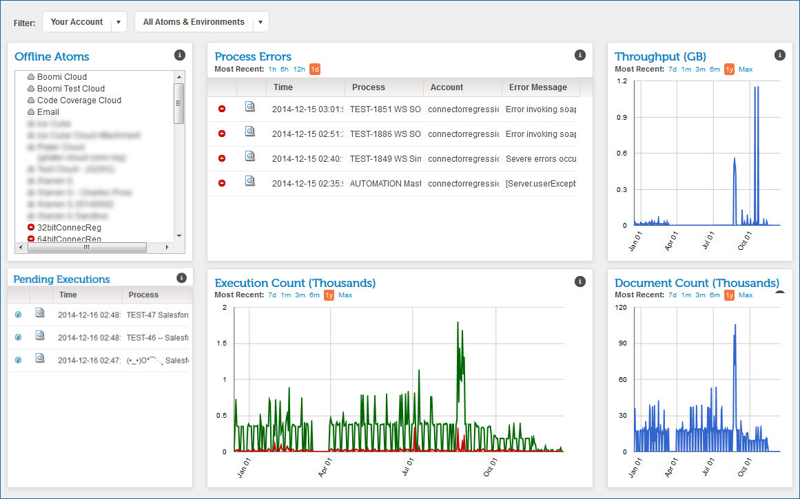

# Dashboards 

<head>
  <meta name="guidename" content="Integration"/>
  <meta name="context" content="GUID-fa580425-b8f3-412c-a1fd-9cd44f3b3178"/>
</head>

Boomi Enterprise Platform’s dashboards provide snapshots of the status of executions, HTTP status codes, and status of low latency processes.

The Account Dashboard is available to all accounts. The HTTP Status Dashboard is available if the Services Enablement feature is enabled in your account.

## Account Dashboard

On the Account Dashboard page you can view a summary of recent activity within your account. If you are a partner supporting multiple customers, this dashboard can provide a summary of your customers' integration activities and a highlight of recent errors and execution trends.

**Note:** Only processes that generate logs appear in the Account Dashboard. Processes that did not execute do not appear, even if they are shown in Process Reporting.

The Account Dashboard page is divided into several sections or gadgets:

-   Offline Atoms

-   Process Errors

-   Throughput

-   Pending Executions and Connector Usage

-   Execution Count

-   Document Count

