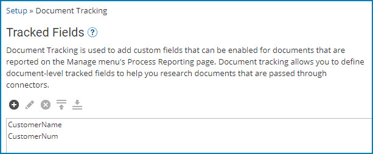

# Document Tracking 

<head>
  <meta name="guidename" content="Integration"/>
  <meta name="context" content="GUID-103F06E6-94BF-472A-9C50-F3780CE5B497"/>
</head>

Use Document tracking to define document-level tracked fields to help you research documents that are passed through connectors.

The **Document Tracking** tab on the Settings page is used to add custom fields that can be enabled for documents that are reported on the Manage menu's Process Reporting page.

After a tracked field is defined, you can configure connector operation components to populate the tracked field with values from the actual document data. You can then use these tracked fields to filter document execution history in the Process Reporting page to quickly find specific documents.

You can define a maximum of 20 tracked fields. Each tracked field’s value is limited to 1000 characters. If the tracked field’s value is longer than 1000 characters, the value is truncated when it is created and stored.

:::note

Tracked fields cannot be used with integration packs.

:::
