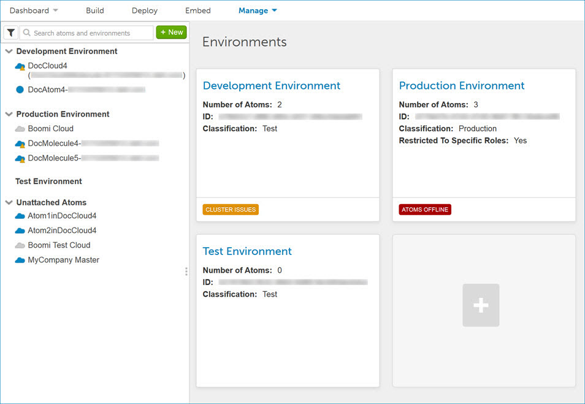

# Environment management 

<head>
  <meta name="guidename" content="Integration"/>
  <meta name="context" content="GUID-1ec94aeb-ffaf-4cec-a3b0-483c2af3967c"/>
</head>

Environments give you greater control over change management and support different connection configurations using extensions.

An environment is a workspace that users create and use for testing or production purposes. Environments enable you to support dedicated and separate deployment setups for different phases of the development life cycle. You can build integrations that are tested and promoted between environments with a full audit trail of what was deployed and by whom. Environments help to ease the management of larger implementation projects that require multiple application setups, on-premise resources, and a distributed architecture.

Accounts are equipped with either Basic or Unlimited environments based upon licensing. Accounts with Basic environment accounts have many of the same capabilities as Unlimited, with the exception that Basic cannot create test environments and can have only one Atom attached to each environment. Accounts with Unlimited environment support can have a separate test environment, which allows you to deploy specific processes for testing scheduled executions, larger document batches, and real-time integration scenarios. In addition, multiple Atoms can be attached to an environment, while multiple packaged components can be deployed to multiple environments. You can fully test deployed processes from end-to-end, avoiding Test mode restrictions, without affecting processes currently running in production.

It is important to understand that deploying connections across different Atoms and environments will affect your license count. Connections are deployed at the Atom level. If you use extensions, you can reuse the same connection components and supply different configuration information at deployment time.

## Use cases for environments

The following are some cases in which you would use environments.

-   Distinguish Between Test and Production — Many applications offer the ability for users to manage production and sandbox accounts. Processes that need to be thoroughly tested may require the storage of alternate configuration information when compared to a production setup.

-   Classify On-Premise Resources — Database setups or network directories may require unique connection information. Managing these resources in different environments helps to ensure data integrity and prevents documents from reaching the wrong destination.

-   Manage Client-specific Projects — A full implementation for a specific client may require a series of processes. Distributing the process workload across different Atom environments for each client can help you to more easily deploy process updates.

## Production and test environments 

If your account has Unlimited environment support and test connections are enabled, when you add an environment you must select a classification. The choices are Production or Test. The classification determines two things:

-   Whether a production or test Atom Cloud can be attached to the environment. Production environments can have only production Atom Clouds attached to them. Test environments can have only test Atom Clouds attached to them. This ensures that production and test Atom Clouds run in separate physical environments.

-   Which type of license is used when a process is deployed to the environment. Production environments are associated with production connection licenses and test environments are associated with test connection licenses. This ensures that you are charged properly for production and test connections.

The classification can be set only when you add an environment. You cannot change it later.

:::note

Environments added prior to the January 2014 release are classified as production environments and cannot be changed.

:::

Contact your representative if you are interested in obtaining test connections. See the topic about test connection licensing to learn how to use test environments with these licenses.

Integrations can be “extended” at the process level to override default connector information, scheduling and process properties. These configurations are applied at deployment time versus at build time and prevent you from having to define this dynamic information at either the individual process or Atom level.

In order to implement environment-level extensions you must:

-   Define process extensions

-   Set environment-level extension values

## Environments with integration packs 

You can attach an environment to integration packs. Where extensions are defined for an integration pack’s assigned processes and components, you can set the extension values at the environment level, just as you can for deployed standard processes. However, you cannot apply pending updates for an integration pack unless the environment has an attached Atom.

## Process deployment 

The Manage menu's Atom Management page is where you create and manage environments. The Deployments page \(**Deploy** \> **Deployments**\) is where you deploy processes and components to environments. When environments are enabled in a account, it is important to understand the differences in deploying processes.

-   Standard Account — Users deploy processes to one or more Atoms.

-   Environment-enabled Account — Users attach Atoms to an environment. Users then deploy processes and components to one or more of these environments. A typical scenario is to have separate test and production environments.

Each of the environments displays a card on the page that provides an overview of the environment. It provides information about the number of Atoms in the environment, if the environment is restricted to specific roles, and if there are any issues with the environment. For instance, if there are Atoms offline, cluster issues, or updates available, icons decorate the bottom of the individual cards for the environment impacted.