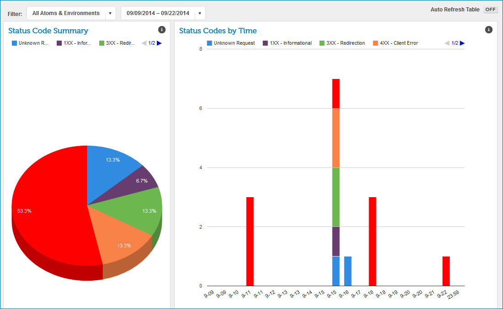

# HTTP Status Dashboard 

<head>
  <meta name="guidename" content="Integration"/>
  <meta name="context" content="GUID-4923f76e-ec22-40b7-9df6-a651c8c192a0"/>
</head>

On the HTTP Status Dashboard you can view a summary of the logs on a particular Atom or environment during a specified period of time.

These logs cannot be viewed in other displays, such as Process Reporting or the Real-time Dashboard, but are available in the shared HTTP server logs. The codes are standard [HTTP status codes](http://en.wikipedia.org/wiki/List_of_HTTP_status_codes): 1XX Informational, 3XX Redirection, 4XX Client Error, 5XX Server Error. 2XX Codes do not display because they are success codes.

Data for dates preceding the introduction of this dashboard in October 2014 do not display.

**Note:** The HTTP Status Dashboard is available only if the Services Enablement feature is enabled in your account.

The HTTP Status Dashboard page is divided into two sections, called gadgets, which display a Status Code Summary and Status Codes by Time.

The HTTP Status Dashboard includes these messages, which cannot be viewed in other dashboards:

-   400 Bad Request — There are miscellaneous errors with the request, for example, mismatches between the request and what is allowed for the operation.

-   401 Unauthorized — Not reported if the user or account cannot be identified and the Atom Cloud is multi-tenant.

-   403 Forbidden — Authentication errors.

-   404 Not Found — Invalid URL path.

-   405 Method Not Allowed — The caller attempted to send input data to a process that cannot receive input data.

-   413 Request Entity Too Large — The request data was too large.

-   503 Service Unavailable — The caller has hit a throttle or the request was rejected because the Atom is starting or stopping.