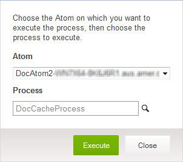

# Process execution 

<head>
  <meta name="guidename" content="Integration"/>
  <meta name="context" content="GUID-0a389d3f-a5bd-4fdc-8ee2-2c1ab31cb6e1"/>
</head>

You can execute a process manually at any time from either the Atom Management or Process Reporting page.

Typically your processes execute automatically according to their configured schedules. See the topic about scheduling processes.

On the Process Reporting page, select the Atom on which you want to execute the process and then select a process to execute. Only processes deployed to the selected Atom are available in the list. Listener processes are not available in the list.

