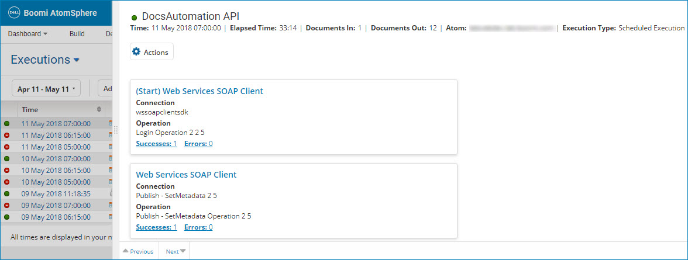

# Process execution document viewing 

<head>
  <meta name="guidename" content="Integration"/>
  <meta name="context" content="GUID-6f00f633-7472-4a85-8f37-c8e91042baa7"/>
</head>

On the Process Reporting page, the search results table displays the process executions that match your search criteria and filters.

You can access a process’ document results by clicking the link in the Time column. The process execution detail view slides over from the right side and partially overlaps the search results table.

In this view you can:

-   See detailed information and logs about the process execution

-   See information about each connection in the process execution

-   For each connection, see how many documents succeeded or failed

-   View successful documents and documents with errors

-   View document logs

-   View error details and Boomi Resolve

-   Navigate to the previous or next process execution

To learn how to use this view, see the topic about the process execution detail view.

:::note

The process execution detail view is not available for test mode executions.

:::

Process execution results are available for 30 days. If you require the data to be kept longer for auditing or other purposes, use the connector operation’s archiving functionality, send data to another location as part of the process logic itself, or use Atom-level processed document archiving. Also review the Atom Management topics to learn how the purging schedule can be adjusted for local Atom history.

:::note

Process execution results are available for the first 10,000 documents. Subsequent documents are processed but are not reported on the Process Reporting page.

:::

## Documents from an aborted process 

If an Atom stops running, any processes that were running are left in an “in process” state until the Atom is restarted. After the Atom restarts, this icon  and a “Recovering documents...” error message appear next to the process on the Process Reporting page. The Atom attempts to recover documents from the aborted process execution’s Start step. Depending on how many processes were running, this could take some time. If the Atom stopped before the process completed the Start step, there will be no documents available to recover.

After the Atom finds the aborted processes and its documents and sends them to the platform, the message on the Process Reporting page and on the process execution detail view changes to “Process aborted...”. Now you can retry or view the recovered documents. One way to do this is to click the process’ Time link. In the process execution detail view, click the Errors link in the Start step to see the documents with errors. Then you can select the documents that you want to rerun.