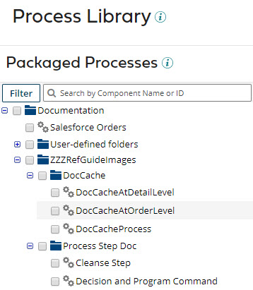

# Publish single or multiple processes 

<head>
  <meta name="guidename" content="Integration"/>
  <meta name="context" content="GUID-a3b0a376-85e8-4ecb-95cd-aab05fdbcc5c"/>
</head>

In the Packaged Processes list, you can either highlight a single packaged process or select multiple packaged processes by turning on check boxes.

**Note:** For Legacy deployment, API Service components can also be published and this list is called Publishable Components.

-   If you *select a single packaged process by highlighting it*, you are indicating that you want to work with one process.

    -   You can use the **Publish Package** button to publish any shareable package version of the selected process.

    -   In the **Publication History** table, you can republish a previous publication version, view the publication details, or compare two versions of a packaged process that have been published.

-   If you *turn on one or more check boxes*, you are indicating that you want to publish one or more packaged processes. The **Publish Multiple Packages** list is displayed.

After you select a packaged process or processes, you are ready to publish them.