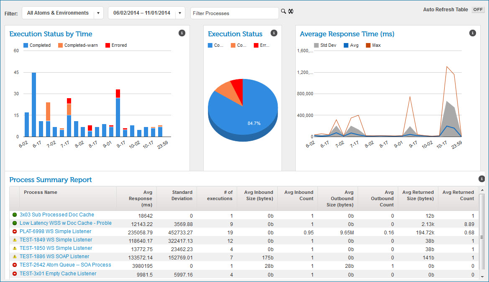

# Real-time Dashboard 

<head>
  <meta name="guidename" content="Integration"/>
  <meta name="context" content="GUID-edb47e3b-fac8-433b-90c3-71db7f94a372"/>
</head>

The Real-time Dashboard page provides summary status of low latency processes that occurred in the time and/or date range that you select.

The low latency process execution information is aggregated, rather than reporting every execution. This summary information, which may be delayed up to five minutes after processes have completed, appears on the Real-time Dashboard rather than the Manage menu’s Process Reporting page.

:::note

The Real-time dashboard is available only if the Services Enablement feature is enabled in your account.

:::

The Real-time Dashboard page is divided into several sections called gadgets.

-   Execution Status by Time

-   Execution Status

-   Average Response Time

-   Process Summary Report

The Real-time Dashboard tracks incoming HTTP requests that result in low latency process execution, including:

-   200 OK — This is a standard response for successful HTTP requests. The actual response depends on the request method used. In a GET request, the response will contain an entity corresponding to the requested resource. In a POST request, the response will contain an entity describing or containing the result of the action

-   500 Internal Server Error — This generic error message appears when an unexpected condition was encountered and a more specific message is not suitable.

-   522 Connection Timed Out — This message is returned to the client when the Atom Worker Maximum Execution Time has been exceeded.

-   Warnings that exceed the low latency warning threshold but do not exceed max execution time.

400 and 503 errors, which are not reported on the Real-time Dashboard, are reported on the HTTP Status dashboard.

:::note

A process execution can complete successfully and return an error to the HTTP client. For example, this can occur if there was a network failure when the final HTTP response was being sent. Process executions that fail after the process has executed successfully appear on the Real-time Dashboard as successful executions.

:::

Detailed information about low latency process warnings or errors is on the Process Reporting page. To see the low latency process error messages, process logs, and other related information similar to non-low latency process information, clear the option Only Generate Process Log on Error.