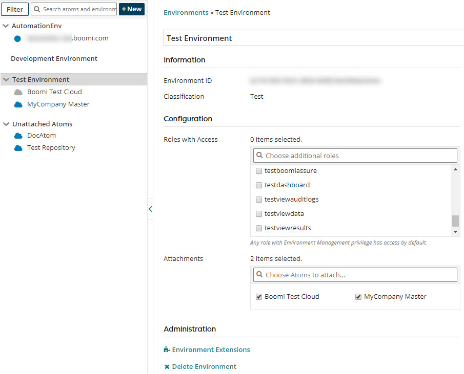

# Roles within an environment 

<head>
  <meta name="guidename" content="Integration"/>
  <meta name="context" content="GUID-36c3859d-4895-44e2-b166-5ba2d911a53e"/>
</head>

Use the **Manage** \> **Atom Management** \> **Environments** page to manage roles for an environment.

The Unattached Roles list contains all roles that have not already been attached to the selected environment.

By default, all roles have access to the environment because access has not been restricted. After roles are assigned to the environment, only users with those roles can access the environment.

