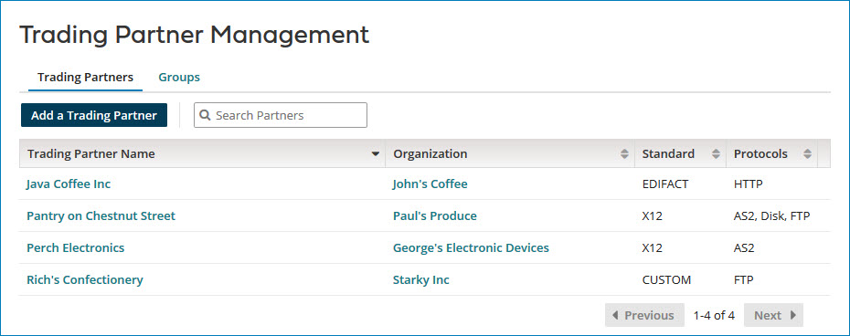

# Trading Partner Management 

<head>
  <meta name="guidename" content="Integration"/>
  <meta name="context" content="GUID-0a507db2-bd16-4d67-9213-4606ab7c46f0"/>
</head>

The Trading Partner Management page \(**Manage** \> **Trading Partner Management**\) is used to view, add, and edit Trading Partner and Processing Group components. This page provides the capability to make changes to these components to users who do not have access to the Build page.

Trading Partner Management is visible only to users who have the Trading Partner Management role.

## Trading Partners tab 

The Trading Partners tab lists in a table all of the Trading Partner components \(both my company and partners traded with\) that are in the account. The columns are Trading Partner Name, Organization, Standard, and \(communication\) Protocols. The table is sortable by any column; by default the table is sorted alphabetically by Trading Partner Name.

To view and edit the details of an individual Trading Partner, click the name of the Trading Partner to open the component configuration dialog. You cannot change the standard.

To view and edit the details of an individual Organization, click the name of the Organization to open the Organization component in a new browser tab.

To add a Trading Partner, click **Add a Trading Partner**. The Create Component dialog opens with Trading Partner as the selected **Type**.

## Groups tab 

The Groups tab lists in a table all of the Processing Group components that are in the account. The columns are Group Name and Trading Partners. The Trading Partners column value is the number of Trading Partners in the Processing Group. The table is sortable by either column; by default the table is sorted alphabetically by Group Name.

To view and edit an individual Processing Group, click the Group Name to open the Processing Group component configuration dialog. If you make changes to the Processing Group, you must redeploy it.

To add a Processing Group, click **Add Processing Group**. The Create Component dialog opens with Processing Group as the selected **Type**.