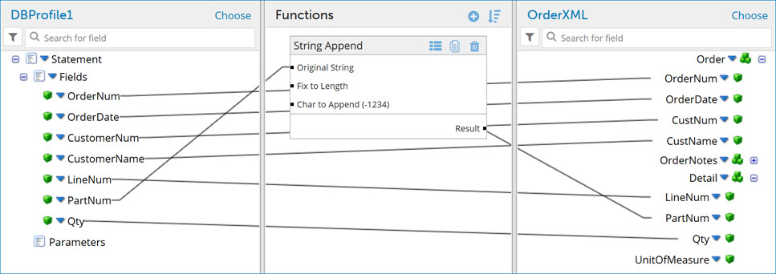

# Adding a standard function to an extended data map 

<head>
  <meta name="guidename" content="Integration"/>
  <meta name="context" content="GUID-f939f056-ff2a-4625-a1e7-6c339811887f"/>
</head>

Create and add extensible user-defined functions within extended data maps.

## Before you begin

Extensible standard map functions allow you to create steps in a defined sequence to perform simple data transformations between profile fields in an extended data map. Use the following steps to add extensible standard functions to an existing map extension.

Standard functions that are created via this method exist only at the environment extension level and are tied only to a single map extension. A given function may be reused within a single map extension but cannot be used across multiple maps within an integration pack or across environments.

## Procedure

1.  In **Manage** \> **Atom Management**, select an environment from the list on the left.

2.  Click the **Environment Extensions** link.

3.  Click on the **Data Maps** tab, then select an extensible map from the Data Maps dropdown.

4.  In the opened map, click  in the Functions column.

    The Add a Function dialog opens.

5.  Do one of the following:

    -   To create a new standard function, select a category and a function type. Then click **OK**. Proceed to the next step.
    -   To add an existing user-defined function, select a function from the Functions folder tree and click **OK**. Proceed to step 7.
6.  Configure the function and click **OK**. The configuration dialog looks different, depending on the function type you chose.

    A box containing the function and default values appears in the Functions column.

7.  Drag and drop fields from your source profile into your functions inputs and then from your function outputs to your destination profile.

    

8.  Click **Save**.