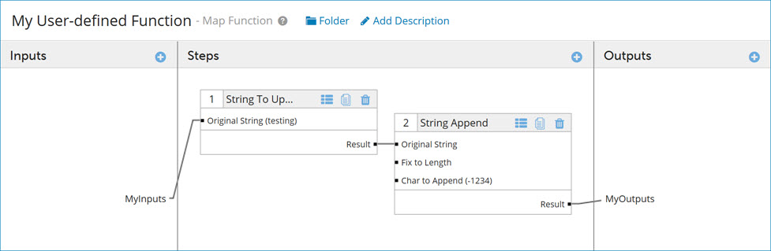
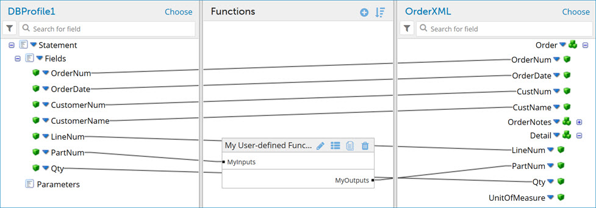

# Adding a user-defined function to an extended data map 

<head>
  <meta name="guidename" content="Integration"/>
  <meta name="context" content="GUID-4ba06b78-8db5-42ea-a58d-593f36be10bb"/>
</head>

Create and add extensible user-defined functions within extended data maps.

## Before you begin

Extensible user-defined map functions allow you to link multiple standard function steps in a defined sequence to perform sophisticated transformations between profile fields in an extended data map. Use the following steps to add extensible user-defined functions to an existing map extension.

User-defined functions that are created via this method exist only at the environment extension level and are tied only to a single map extension. A given function may be reused within a single map extension but cannot be used across multiple maps within an integration pack or across environments.

:::info Important

The Environment Map Extension User Defined Function API object \(which represents the actions detailed in this task\) and other Environment Map Extension API objects require the client to know the ID of the environment map extension. In the user-defined function interface, click **Copy EME ID** to easily copy this ID for use in your API requests.

:::

## Procedure

1.  In **Manage** \> **Atom Management**, select an environment from the list on the left.

2.  Click the **Environment Extensions** link.

3.  Click on the **Data Maps** tab, then select an extensible map from the Data Maps dropdown.

4.  In the opened map, click  in the Functions column.

    The Add a Function dialog opens. The User Defined category is selected by default.

5.  Do one of the following:

    -   To create a new, extensible user-defined function, click the **Create New Function** icon, then proceed to the next step.
    -   To add an existing user-defined function, select a folder from the Functions folder tree and click **OK**. Proceed to step 15.
6.  A new tab opens which is named New Map Function. Enter a name for the function.

7.  Click  in the Steps column. The Add a Function dialog opens.

8.  Select a category and a standard function type, then click **OK**.

9.  In the Configure Defaults dialog, enter default values, and select a caching option if desired. Click **OK**.

    The new function is added to the Steps column. To add another function step, repeat steps 5-9. To remove an unwanted step in the function, click the trash icon on that step.

10. In the Inputs column, click . Enter a name and click **OK**.

11. In the Outputs column, click . Enter a name and click **OK**.

12. Drag and drop the function input to the first function step.

13. Drag and drop the first step's result to the next step. Repeat as needed to link additional steps.

14. Drag and drop the last step's result to the function output.

    The lines define the step order in which the function is executed. The example below shows a two-step function. The input is linked to step 1, step 1 is linked to step 2, and step 2 is linked to the output.

    

15. Click **Save and Close**. The function appears in the data map.

16. To map through your new user-defined function, drag and drop fields from your source profile into your functions inputs and then from your function outputs to your destination profile.

    

    :::note

    Padding is added to profile elements with short names to make it easier to specify the elements as destinations for mappings. As a result, the line connecting the source element to the destination element may not extend to the start of the destination profile name.

    :::

17. Click **Save**.

18. After creating or adding a user-defined function to an extended map, use the , , and  icons to edit and delete functions or function steps, respectively.

## Results

The values indicated in your user-defined function take precedence over process-level map configurations at runtime.