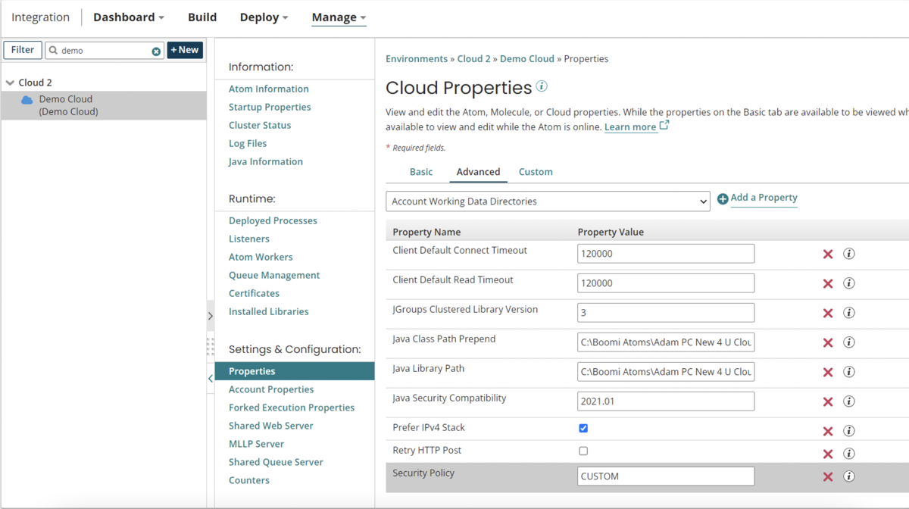

# Converting from custom to HIGH security policies 

<head>
  <meta name="guidename" content="Integration"/>
  <meta name="context" content="GUID-6e30adbc-c806-497b-9e86-47b9487aa567"/>
</head>


Using Boomi's HIGH security policy and configuring any customizations with the Atom Security Policies object ensures that you automatically receive the new policy changes from Boomi without having to make manual changes to your custom security files.

## About this task

Configuring custom security policies by using a separate CUSTOM policy file has been deprecated as of June 2023. Use the steps in this topic to convert to a HIGH security policy and then use the [Atom Security Policies object](https://developer.boomi.com/api/platformapi#tag/AtomSecurityPolicies) to manage any required customizations.

## Procedure

1.  Identify which containers are configured to use CUSTOM security policy files by using the Boomi UI or the Platform API.

    -   In the Platform, go to **Manage** \> **Atom Management**, and for each Molecule and Atom Cloud, go to the Properties panel, Advanced tab and look for the property Security Policy with a CUSTOM value.

        

    -   Using the Platform API, first use the [Atom object](https://developer.boomi.com/api/platformapi#tag/Atom) to query `type="CLOUD"` or `type="MOLECULE`. Then for each Molecule and Atom Cloud, use the [Atom Startup Properties object](https://developer.boomi.com/api/platformapi#tag/AtomStartupProperties) to retrieve the container's properties. Look for `securityPolicyLevel="CUSTOM"`.
2.  For each container that uses a CUSTOM policy, identify which permissions are customized in each policy file.

    -   Obtain the custom policy files from the local container's \<ATOM\_ROOT\>/bin directory: procbrowser-CUSTOM.policy, procrunner-CUSTOM.policy, and procworker-CUSTOM.policy.
    
    :::note
    
    By convention, custom changes are typically organized under the `//custom` section of the files, however this is not required. You can use a text diff utility to identify all of the differences between your files and Boomi's standard policy files.

    :::

3.  Use the UPDATE operation of the [Atom Security Policies object](https://developer.boomi.com/api/platformapi#tag/AtomSecurityPolicies) to customize the HIGH security policy with your existing custom policies. See the example in the following section.

4.  In **Atom Management**, on the Properties panel, Advanced tab, set the Security Policy property to HIGH.

5.  Restart the Molecule or Atom Cloud for the changes to take effect.

    :::note
    
    If you automate provisioning for your containers, be sure to modify any scripts or other assets to change the security policy property to HIGH and use the API to make any custom changes.

    :::

## Procedure

The following example shows how a custom policy set by using the CUSTOM file can be configured by using the [Atom Security Policies object](https://developer.boomi.com/api/platformapi#tag/AtomSecurityPolicies):

Custom Policy File

In this snippet of an example policy file, there is a custom policy to grant permission to a local directory, my/Custom/Dir:

``` {#codeblock_gtl_ysw_rxb}
{ATOM_ROOT}/bin/procrunner-CUSTOM.policy

…
grant {
  …
  // misc other permissions
  permission java.lang.RuntimePermission "accessDeclaredMembers";
  permission java.lang.RuntimePermission "instantiateClassLoader";
  permission java.lang.RuntimePermission "setContextClassLoader";
 

  // custom permissions
  permission java.io.FilePermission "/my/Custom/Dir", "read,write,delete";
};
…

```

REST API Request example

You can use the UPDATE operation of the [Atom Security Policies object](https://developer.boomi.com/api/platformapi#tag/AtomSecurityPolicies) to configure a HIGH security policy with the custom permissions in the example code snippet above:

``` {#codeblock_zx4_htw_rxb}
POST https://api.boomi.com/api/rest/v1/ACCOUNT_ID/AtomSecurityPolicies/CONTAINER_ID

<bns:AtomSecurityPolicies xmlns:xsi="http://www.w3.org/2001/XMLSchema-instance" xmlns:bns="http://api.platform.boomi.com/" atomId="CONTAINER_ID">
        <bns:common/>
            <bns:policies privilegeType="java.io.FilePermission">
                <bns:arguments value="/my/Custom/Dir"/>
                <bns:arguments value="read,write,delete"/>
            </bns:policies>
        </bns:common>
        <bns:runner/>
        <bns:worker/>
        <bns:browser/>
</bns:AtomSecurityPolicies>

```

:::note

The Atom Security Policies object allows you to configure custom policies for the individual JVM types \(runner, worker, and browser\), however it is most typical to configure the policies by using the `common` section to apply to all three types.

:::
