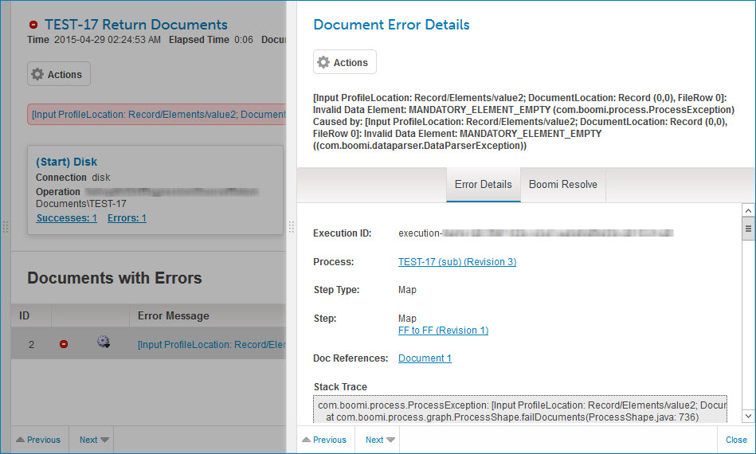
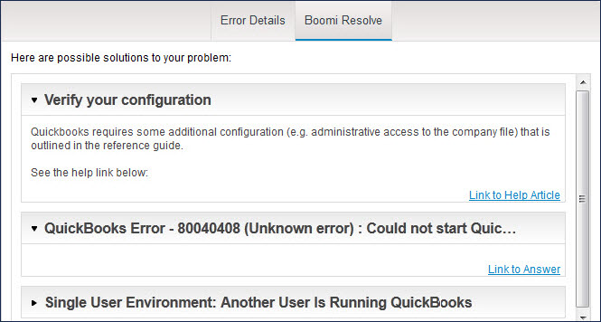

# \(Document or Process\) Error detail view 

<head>
  <meta name="guidename" content="Integration"/>
  <meta name="context" content="GUID-e97159df-14eb-4065-bbec-9cff25b8a50a"/>
</head>

In the execution detail view, clicking an error message in the **Documents with Errors** list or above the connections list opens a detail view for the error.

Process errors record the overall execution for all documents processed; whereas document errors record the execution of a single document. Depending on the nature of the failure, the detail may apply either to a specific document or to the execution.

Clicking and dragging the **** icon in the view border adjusts the width of the view.

The top portion of the view contains a description of the error.

For additional information on viewing document logs and process logs, see the topics [Viewing a document log](./t-atm-Viewing_a_document_log_d5679021-527b-4d11-a12e-1132830a592f.md) and [Viewing a process log](./t-atm-Viewing_a_process_log_cf926bcb-17b1-40e4-8a00-321accf98af4.md).

## Actions 

Clicking the ** Actions** button opens a menu containing the following selections (document errors only):

- ** View Logs** - Opens the Show Log dialog for viewing events recorded during the processing of the document.

- ** View Document** - Opens the Document Viewer dialog for viewing the data in the document.

- ** Re-run Document** - Initiates a request to rerun the document. In the confirmation dialog:

   - Clicking **OK** executes the request.

   - Clicking **Cancel** cancels the request.

- ** Run Document in Test Mode** - Initiates a request to rerun the document in test mode. In the confirmation dialog:

   - Clicking **OK** executes the request.

   - Clicking **Cancel** cancels the request.

## Error Details Tab 

This tab shows the following information about the error and its context. If you need to submit a support request for help with the error, copy and paste the contents of the tab, including the **Stack Trace**, into the request.

**Execution ID** - ID of the execution.

**Process** - Name and revision level of the executed process. This is a link to the process, which opens in a new browser tab or window.

**Step Type** - The type of step in which the error occurred.

**Step** - The names and revision levels of components used in the step in which the error occurred. Each component name/revision pairing is a link to the component, which open in a new browser tab or window.

**Doc References** - Documents referenced by the error message. Clicking a link to a referenced document opens the Document Viewer dialog for viewing the data in the document.

**Stack Trace** - This identifies the location in code in which the error occurred.

## Boomi Resolve Tab 

This tab shows as many as 10 possible solutions to the error, in descending order of relevancy.

Clicking the expand icon adjacent to a solution heading shows solution detail, including links to articles in the Boomi Community.

## Navigation bar 

The following navigation controls are in the bar at the bottom of the view:

- ** Previous** - (Document errors only) Navigates to details for the previous document in the **Documents with Errors** list. Keyboard shortcut: **Up arrow**.

- **Next ** - (Document errors only) Navigates to details for the next document in the **Documents with Errors** list. Keyboard shortcut: **Down arrow**.

- **Close** - Closes the view, returning focus to the process execution detail view. Keyboard shortcut: **Esc**.

:::note

You can also close the view by clicking in the process execution detail view.

:::