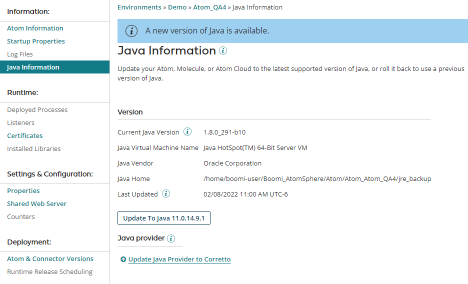

# Java Information panel 

<head>
  <meta name="guidename" content="Integration"/>
  <meta name="context" content="GUID-f3d5ead4-d23a-4420-a649-5178a2417fdf"/>
</head>

The Java Information panel on the Atom Management page **Manage** \> **Atom Management** is where you view details about and manage the Java version of a container.

The Java Information panel contains information related to the Java provider that was previously displayed on the Atom Information panel. When you click an Atom, Molecule, or Atom Cloud in the list, the Java properties appear on the panel whether it is online or offline.

**Current Java Version**  
Version number of the Java Runtime or the JDK in which the Atom, Molecule, or Atom Cloud resides.

**Java Virtual Machine Name**  
 Name of the Java virtual machine to which the Atom, Molecule, or Atom Cloud is deployed.

**Java Vendor**  
The vendor from which the version of Java installed on the Atom, Molecule, or Atom Cloud originates. supports Java versions from Amazon and Oracle.

**Java Home**  
The directory where Java is installed. This is the path that your Atom, Molecule, or Atom Cloud uses to access the Java Runtime.

**Last Updated**  
The date and time the Java version was last updated. This field is visible only when the container has been updated at least once after the release of the latest Java version.

If there is a new version of Java available, you can upgrade the Atom, Molecule, or Atom Cloud directly from the by clicking **Update to Java < version number \>**. If the Atom, Molecule, or Atom Cloud is already upgraded to the latest Java version, you can roll back to a previous version by clicking **Roll back Java**.

For more information on managing the Java version from the , see the topics [Upgrading an Atom, Molecule, or Atom Cloud to Java 11 directly from Atom Management](int-Upgrading_an_atom_molecule_or_atom_cloud_to_java_11_directly_from_atom_management_bdea4653-92de-4ee7-9f42-e11684546e02.md) and [Rolling back an Atom, Molecule, or Atom Cloud to use a previous version of Java](int-Rolling_back_an_Atom_Molecule_or_Cloud_to_use_previous_version_of_Java_b168acd7-3fad-4487-b1d7-38bebd833301.md).

## Auto-update

You can set a schedule to automatically update a container to the latest version of Java when it becomes available. To learn more about setting a Java update schedule, see the topic [Setting a schedule to update an Atom, Molecule, or Atom Cloud to the latest Java version](int-set_a_schedule_to_update_an_atom_molecule_or_atom_cloud_to_the_latest_java_version_9b4dc31f-150d-4045-bba1-5e688ef3eb57.md).