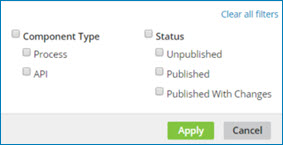
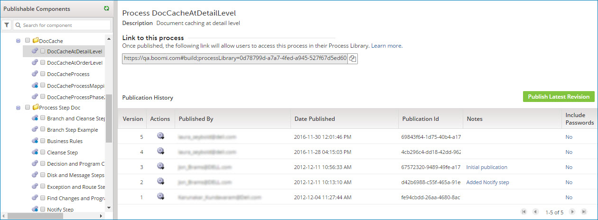
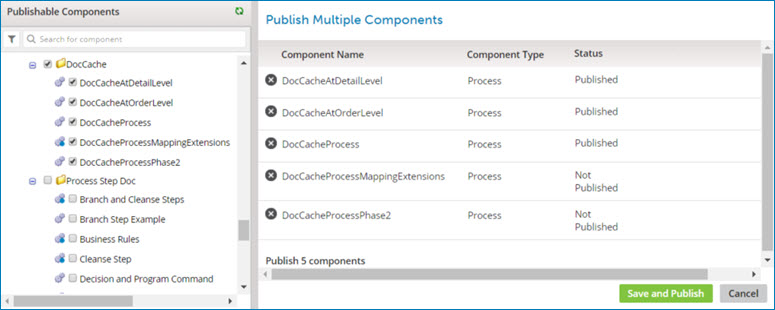

# Process Library page \(Legacy, non-environment\) 

<head>
  <meta name="guidename" content="Integration"/>
  <meta name="context" content="GUID-68e206d2-8ad5-48f8-b35d-052051651645"/>
</head>

Selecting **Manage** \> **Process Library** opens the Process Library page.

The page consists of the following areas:

-   Publishable Components list — A list of processes and API Service components that are available for publishing.

    At the top of the list there is a filter icon  and a search box. You can search for components to publish by using one of the preset filters or by typing all or part of a component name. The available preset filters are:

    -   Component Type — Process and API Service

    -   Status — Unpublished, Published, and Published with Changes

    

-   Single selected component \(when one component is highlighted\)

    

-   Publish Multiple Components \(when one or more component check boxes are turned on\)

    