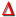
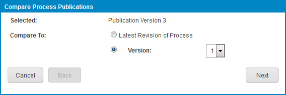
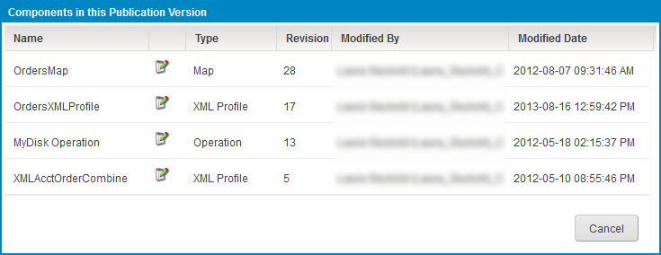

# Publication history \(Legacy, non-environment\) 

<head>
  <meta name="guidename" content="Integration"/>
  <meta name="context" content="GUID-1ed5e6db-4957-41e8-9e13-fed62078958c"/>
</head>

The Publication History table in the Process Library page displays, in descending order, all published versions of the process or API Service component highlighted in the Publishable Components list.

For each version the following information is shown:

**Version**   
The version number.

**Published By**   
The email address of the person who published the version.

**Date Published**   
The date and time of publication.

**Publication Id**   
A unique version ID.

**Notes**   
Publication notes as added by the publisher, if any.

**Include Passwords**   
For published processes, indicates whether passwords that are specified within the process are included in the publication.

In the Publication History table, clicking the **Actions** icon  for a given version opens a drop-down menu with the following options:

**Name**  
**Description**

** Re-Publish this Version**
Opens the Publish Process \(or Publish API\) dialog for the purpose of republishing this version as the current version.

** Compare Publication**
Opens the Compare Process Publications \(or Compare API Publications\) wizard, which is used to compare the components in this version and their revision levels with those in another version.

** View Component Publications**
:   Opens the Components in this Publication Version dialog, which is used to view a list of the components in this version and their revision levels.

