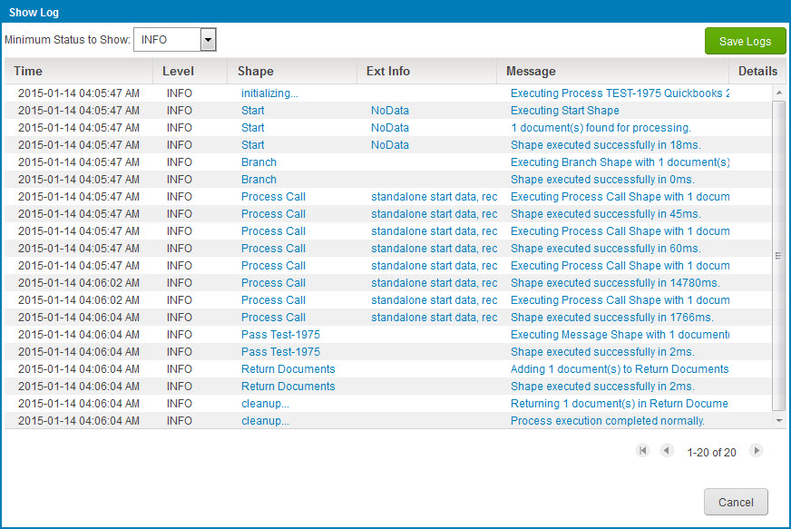

# Show \(Event\) Log dialog 

<head>
  <meta name="guidename" content="Integration"/>
  <meta name="context" content="GUID-fe18e1ed-bee8-4092-a855-037aa7098ff6"/>
</head>

The Show Log dialog shows events logged during a process execution or the processing of a specific document.

Open the dialog from the **Manage** menu’s **Process Reporting** page.

-   Events logged during an execution are shown when ** View Process Logs** is clicked for the execution in the execution search results or selected in the ** Actions** menu in the execution detail view.

-   Events logged during the processing of a specific document are shown when ** View Logs** is selected in the ** Actions** menu for the document in either a process execution detail view, the Document detail view or the View Linked Documents dialog.

## Minimum Status to Show 

Filters the display of logged events by notification level.

-   DEBUG — Show all events.

-   INFO — Show only INFO-, WARNING- and SEVERE-level events.

-   WARNING — Show only WARNING- and SEVERE-level events.

-   SEVERE — Show only SEVERE-level events.

## Save Logs 

Clicking this button initiates a request to download the log as a Zip file. Depending on your browser and its download settings, you may be prompted to specify the destination path and filename. The default filename is process\_log.zip.

## Event list 

For each logged event, the following properties are shown:

-   Time — The date and time of the event.

-   Level — The notification level of the event \(DEBUG, INFO, WARNING or SEVERE\).

-   step — The name of the event, which could be that the execution is starting or stopping, or it could be the name of a step being executed. The execution of a step may require more than one entry in the log. If the event is associated with the execution of a labeled step, the step label is shown.

-   Ext\(ended\) Info\(rmation\) — If the event is associated with a step, further information about the step may be shown in this column, depending on the step type. Clicking the extended information opens a window showing the full text.

-   Message — A message explaining what happened in the event. If the event is the successful execution of a step, its processing time is displayed in milliseconds \(ms\). For example: \(Stop\) executed successfully in 2 ms. Clicking the message opens a window showing the full message.

    

-   Details — If the event’s notification level is SEVERE and the event relates to a specific document that encountered errors, clicking  in this column opens the Stack Trace dialog.

    

The following controls are used to navigate long logs:

-  - Shows the first items in the list.

-  - Shows the previous items in the list.

- **X-Y of Z** - Indicates the number and relative position of items currently visible — for example, “51-75 of 2086”.

-  - Shows the next items in the list.

-  - Shows the last items in the list.
