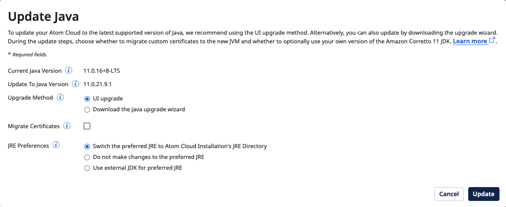

# Upgrading an Atom, Molecule, or Atom Cloud to Java 11 directly from Atom Management 

<head>
  <meta name="guidename" content="Integration"/>
  <meta name="context" content="GUID-bdea4653-92de-4ee7-9f42-e11684546e02"/>
</head>

You can upgrade the Java version of an online Atom, Molecule, or Atom Cloud directly from the Java Information panel in **Atom Management**.

## About this task

We strongly recommend upgrading via Atom Management, in the platform. However, if you want to download the upgrade wizard instead of upgrading directly from the platform, select **Download the Java upgrade wizard** for the **Upgrade Method** and then click **Download and Close**. See the topic [Upgrading an Atom or Molecule to Java 11](int-Upgrading_an_Atom_or_Molecule_to_Java_11_d46de877-3973-4353-95f8-d3e17f435b0e.md) for more information.

If the Atom, Molecule, or Atom Cloud is offline, **Download the Java upgrade wizard** is the default option.

:::info Important

After upgrading the Java version, you must perform a rolling restart for multi-node Molecules or Atom Clouds.

:::

## Procedure

1.  In the user interface, navigate to **Manage** \> **Atom Management**.

2.  Select the Atom, Molecule, or Atom Cloud that you want to upgrade and click **Java Information**.

3.  Click **Update to Java \<version number\>**.

    A dialog box opens with the following information and options:

    -   Current Java Version

    -   Update To Java Version

    -   Upgrade Method

    -   Migrate Certificates

    -   JRE Preferences

    

4.  To upgrade directly from the select UI upgrade for the **Upgrade Method**.

    :::note
    
    Steps 5 and 6 are available only for the UI upgrade method.

    :::

5.  \(Optional\) Select the checkbox next to **Migrate Certificates** if you want to migrate any certificates during the upgrade process and then locate the folder containing the JDK that your Atom, Molecule, or Atom Cloud is using next to **Certificate Path**.

    :::note

    The certificates that can be migrated during this step are located in the /lib/security/cacerts directory.

    :::

6.  Next to **JRE Preferences**, select one of the following options:

    -   **Switch the preferred JRE to Atom Installation's JRE Directory** - Updates your Atom with Boomi's latest version of Java and changes the location in the pref\_jre.cfg file. The pref\_jre.cfg file contains the path to the JRE that the Atom will use.

    -   **Do not make changes to the preferred JRE** - Updates your Atom with Boomi's latest version of Java but does not change the location in the pref\_jre.cfg file. The pref\_jre.cfg file contains the path to the JRE that the Atom uses currently.

    -   **Use external JDK for preferred JRE** - Uses a custom distributed version of Java 11. Next to **External JDK Path**, enter the location of the folder that contains the external JDK that you want to use.

    :::note

    For **Switch the preferred JRE to Atom Installation's JRE directory** and **Do not make changes to the preferred JRE**, if the Atom is currently using the JRE directory, the new Java version is downloaded into the jre_a (previously named jre_backup) folder, otherwise the new Java version is downloaded into the JRE directory.

    :::

7.  Click **Update**.

    A pop-up dialog box displays in the bottom right corner of the screen, indicating that the upgrade will begin shortly.