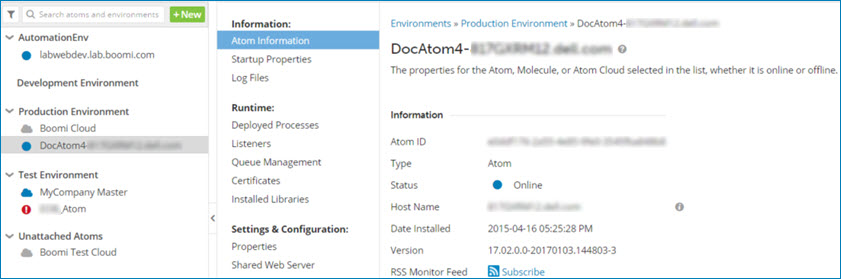
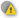
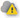
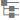

# Atom status list 

<head>
  <meta name="guidename" content="Integration"/>
  <meta name="context" content="GUID-6be70029-91cf-4ef8-901f-67be0516a18a"/>
</head>

You can view runtime information, settings and configuration, and deployment information for Atoms, Molecules, and Atom Cloud (Cloud Molecule and Cloud Attachment) in Atom Management.

On the left side of the Atom Management page is a list of the Atoms, Molecules, and Atom Clouds to which your account has access. Clicking an Atom, Molecule, or Atom Cloud in the list displays information about it on the right side of the page.

Atoms, Molecules, and Atom Clouds are listed alphabetically by type. If your account uses environments, each Atom, Molecule, or Atom Cloud appears below the environment to which it is attached. Unattached Atoms, Molecules, and Atom Clouds appear in the Unattached Atoms list.

In order to execute processes and view execution logs, the Atom, Molecule, or Atom Cloud must be online. Atoms, Molecules, and Atom Clouds attempt to report their status back to the platform every five seconds. If the attempt fails \(because the platform cannot be reached, for example\), they retry at increasing intervals of 10 seconds, 30 seconds, 1 minute, 2 minutes, and 5 minutes. After the 5-minute retry interval is reached, retry attempts continue indefinitely at random intervals.

Atom, Molecule, and Atom Cloud status is displayed here as one of the following status indicators:

**Icon**  
**Type of Resource**

  
The local Atom or Molecule is online and is communicating with the platform.

  
The local Atom or Molecule is new or the platform is unable to determine the status. Or, one or mode nodes in the Molecule are restarting or reported a problem.

  
The local Atom is stopping or restarting.

  
The local Atom is stopping or restarting, but it has not responded within five minutes \(if the Force Restart value is not set on the Properties panel\) or within one minute over the Force Restart value \(if the Force Restart value is set on the Properties panel\).

  
 The local Atom stopped communicating with the platform and may have terminated unexpectedly.

  
The local Atom or Molecule is not running.

  
The local Atom or Molecule is not running, but it did not shut down cleanly.

  
The Cloud Molecule or Cloud Attachment is running and communicating with the platform.

  
 One or more nodes in the Cloud Molecule or Cloud Attachment are reporting clustering issues.

  
The Cloud Molecule or Cloud Attachment is not running.

  
The Cloud Molecule or Cloud Attachment is not running, but it did not shut down cleanly.

## Filter Atoms by type and status 

The Atom Management page allows for filtering and searching. You can filter by Type \(Atom, Molecule, or Cloud\) or Status \(Online, Offline, or Cluster Issues\). Once you have a filter applied, a search returns only items that meet the filter criteria in the search results.

To add a filter, click  and select the Type or Status that you want to filter on.

If the icon is colored , one or more filters is applied. Click the icon to remove or change the filter.

## Show or hide the Atom status list 

The Atom Management page allows you to hide the Atom status list. To hide the list, click **\<** between the Atom status list and the Atom Management panel. While the list is hidden, the **Show Environments and Atoms** icon is visible in the vertical bar to the left of the Atom Management panel.

To reveal the list of Environments and the Atoms, Molecules, and Clouds, either:

-   Click **Show Environments and Atoms**.
-   Click **\>** immediately to the right of the bar in which **Show Environments and Atoms** is visible.