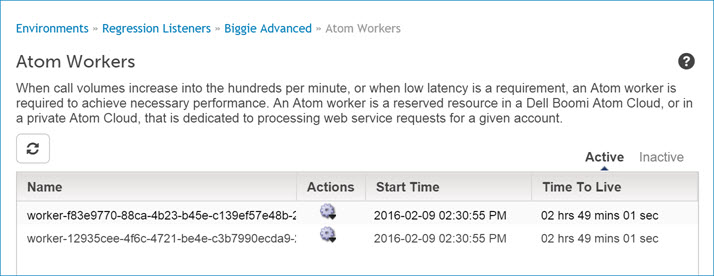

# Atom Workers panel 

<head>
  <meta name="guidename" content="Integration"/>
  <meta name="context" content="GUID-6aacf64c-6464-4015-9036-6200098cc517"/>
</head>

The Atom Workers panel shows the Atom workers in the Atom Cloud and displays basic information about each worker.

Access the Atom Workers panel appears on the Atom Management page \(**Manage** \> **Atom Management**\) by clicking an Atom Cloud in the list. By default, the workers are sorted by start time in descending order. You can sort columns except the Actions column.

This panel is visible to Cloud owners and tenants. Cloud owners and tenants see only the Atom worker\(s\) allocated to their account in this Cloud.

The information about each Atom worker is based on the start date of the Atom worker and is available for 30 days, after which it is purged.

Atom workers are configured to run for 24 hours then shut down automatically. You can change the length of time after which Atom workers shut down by setting the **Atom Worker Time To Live** property on the Advanced tab of the Properties panel. If you are a Cloud owner and you need to shut down an Atom worker for any reason during that period, you can do so on this panel. When an Atom worker is shut down, either automatically or manually, an entry is added to the Cloud’s audit log.

**Name**  
**Description**

  
Clicking **Refresh** refreshes the currently displayed list.

  
This icon appears next to each Atom worker. This menu has the following selection\(s\):

-   **Stop Atom Worker** \(Active view only\) — Opens a dialog in which you must confirm that you want to stop the Atom worker.
-   **View Worker Details** — Opens the Atom Worker Details dialog. In the Inactive view this dialog displays the Atom worker’s ID, completion time, the reason that it stopped and node ID. In the Active view this dialog displays the Atom worker’s ID, time to live and node ID.
-   **Download Log** — This action immediately initiates a download of the Atom Worker log to your local downloads folder. Atom Worker logs provide detailed information about the selected worker, such as the worker's start and shutdown times, low latency process executions, reports about any memory errors that may have occurred, and the Atom worker load.

**Time to Live** \(Active view only\)  
Each Atom worker shuts down automatically after 24 hours, unless you change the **Atom Worker Time to Live** property to a different amount of time. The column displays the amount of time remaining in that period in hours, minutes, and seconds.

:::note

If the load on active Atom workers drops, the Atom Cloud reduces the number of Atom workers to the **Minimum Atom Workers** property value. In that case, it is possible for an Atom worker to shut down before its **Atom Worker Time to Live** value is reached.

:::

**Status** \(Inactive view only\)  
Icons in this column indicate the following:

-    — The Atom worker ran successfully for its configured length of time.
-    — The Atom worker did not run successfully for its configured length of time. It was stopped automatically.
-    — The Atom worker did not run successfully for its configured length of time. It was stopped manually from this tab.