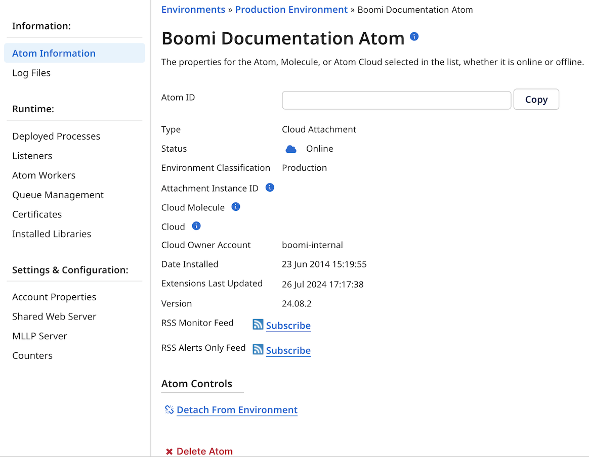

# Atom Information panel 

<head>
  <meta name="guidename" content="Integration"/>
  <meta name="context" content="GUID-1B7C4D63-9AAF-4252-B9A0-7A3B386BF1A9"/>
</head>

The Atom Information panel on the Atom Management page \(**Manage** \> **Atom Management**\) is where you view details about an Atom. If you have privileges, you can delete and/or restart Atoms and attach it to or detach it from environments.

When you click an Atom, Molecule, or Atom Cloud (Cloud Attachment and Cloud Molecule) in the list, its properties appear on the panel whether it is online or offline.

**Atom ID**  
A unique ID for the Atom, Molecule, Cloud Attachment, or Cloud Molecule. Use the **Copy** button to copy the ID for reference or troubleshooting.

**Gateway ID** 
Unique ID for Gateway.

**Type**  
Identifies the resource as the Atom, Molecule, Cloud Attachment, Cloud Molecule, or Gateway. 

**Status**  
Indicates whether the Atom, Molecule, Cloud Attachment, Cloud Molecule, or Gateway is online, offline, or has cluster issues.

**Environment Classification** 
Class type of the environment: Production Environment or Test Environment.

**Attachment Instance ID** 
A unique identifier for Cloud Attachments, a combination of the Attachment's account ID and a system-generated suffix.

**Cloud Molecule** 
Name of the associated Cloud Molecule for the Cloud Attachment.

**Cloud** 
Name of the associated Atom Cloud for the Cloud Attachment or Cloud Molecule. 

**Cloud Owner Account** 
The name of the account that owns the runtime cloud to which this cloud molecule or cloud attachment is associated. 

**Host Name**  
Name or IP address of the machine where the Atom, Molecule, Cloud Molecule, or Cloud Attachment is installed. If the selected Atom is attached to an Atom Cloud, the name of the Atom Cloud is displayed.

**Date Installed**  
The date and time at which the Atom, Molecule, Cloud Attachment, Cloud Molecule, or Gateway was installed, in the format yyyy-MM-dd HH:mm:ss. For Atoms attached to an Atom Cloud, this is the date and time at which the Atom Cloud was installed.

**Extensions Last Updated**  
The date and time at which process extension values were last updated on this Atom, Molecule, Cloud Attachment, Cloud Molecule, or Gateway.

If all of the Atoms attached to an Atom Cloud have not yet been updated due to a communications delay, a warning message is displayed. The message is cleared when you refresh the screen, assuming extensions on all of the Atoms are up to date.

:::note
 If the process extension values have never been updated or the current environment has no extensions defined, this field does not appear.
 :::

**Version**  
String identifying the Atom, Molecule,  Cloud Attachment, Cloud Molecule, or Gateway’s latest build. This string might be used by Support when they are troubleshooting an issue.

**RSS Monitor Feed**  
Link to RSS feed for all statuses and process activity for this Atom, Molecule, Cloud Attachment, Cloud Molecule, or Gateway.

**RSS Alerts Only Feed**  
Link to RSS feed for only alerts and process errors for this Atom, Molecule, Cloud Attachment, Cloud Molecule, or Gateway.

## Atom Controls 

If you have the Atom Management privilege, you can perform various actions on an Atom. The actions that are available depend on the Atom's status and whether you are the Atom's owner.

:::note

You must have the Atom Management privilege to perform most of the actions in the **Atom Controls** section. If you have the Atom Management Read Access privilege, you can only subscribe to RRS feeds and view Atom extensions and integration pack information, if available.

:::

**Atom Extensions**  
Opens the Extensions dialog, where you can set extension values for processes that are deployed to the selected Atom.

**Attach to Environment**  
For Atoms that are currently unattached, attaches the Atom to the environment that you select from the drop-down list.

:::note

For accounts with Basic environment support, each environment in the account can have a single Atom attached. For accounts with Unlimited environment support, each environment can have an unlimited number of Atoms attached.

:::

**Clear Detailed Atom Status Information**  
Clears status information about the Atom \(such as whether it is restarting or when it was last online\) from the platform. Status information is refreshed the next time the Atom reports to the platform.

:::note

Clearing Atom status information from the platform does not change the Atom's status or impact executing processes in any way.

:::

**Delete Atom**  
Deletes information about the Atom, Molecule, or Atom Cloud from the platform.

Use this action if the Atom, Molecule, or Atom Cloud still appears on the Atom Management and Process Reporting pages after being deleted from the machine where it was installed.

**Detach from Environment**  
Detaches the Atom from the environment to which it is attached. After this action is complete, the Atom will be shown as unattached.

**Restart Atom**  
Restarts the Atom. In the case of Molecules and Atom Clouds, a rolling restart is performed.

**Update to use Java**  
Used to upgrade the selected Atom, Molecule, or Cloud Molecule so that it uses the latest minor version of Java 11 available. Clicking this link opens a dialog from which you can download the Java upgrade program.

**Update Java Provider to Corretto**  
This option updates the Java provider for your Atom, Molecule, or Atom Cloud on Java 8 to Amazon Corretto. officially supports the Amazon Corretto JDK distribution, so it is highly recommended that you update your Atom, Molecule, or Atom Clouds off of Oracle to avoid licensing concerns when applying your own security patches.

:::note

This feature does not upgrade your container to Java 11 but simply updates your Java 8 container to the -supported Java provider. This feature is available only for 32-bit containers on Windows and 64-bit containers for both Windows and Linux.

:::
