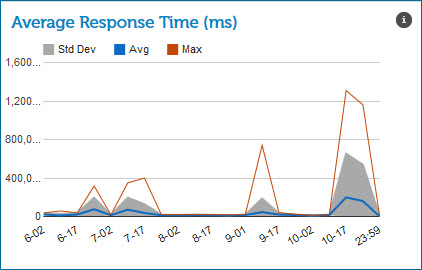

# Average Response Time gadget 

<head>
  <meta name="guidename" content="Integration"/>
  <meta name="context" content="GUID-555b21ac-6563-4423-9e58-9bb2fb62b1ac"/>
</head>

The Average Response Time gadget on the Real-time Dashboard page shows low latency process executions by average time in milliseconds \(ms\) that it took to complete.

This gadget shows low latency process executions that occurred in the time and/or date range that you selected. Low latency processes that failed are not included.

The labels on the X axis vary based on the time and/or date range that you selected. The values on the Y axis vary based on the number of process executions that occurred in the time and/or date range that you selected. The status types are displayed in a graph.

-   Standard Deviation — Displays in gray. Pause on or click a gray area in the graph to see the time and/or date range and the standard deviation for the time group that you selected.

-   Average — Displays in blue. Pause on or click a blue line in the graph to see the time and/or date range and the average response time in the time group that you selected.

-   Maximum — Displays in orange. Pause on or click an orange line in the graph to see the time and/or date range and the maximum response time in the time group that you selected.

