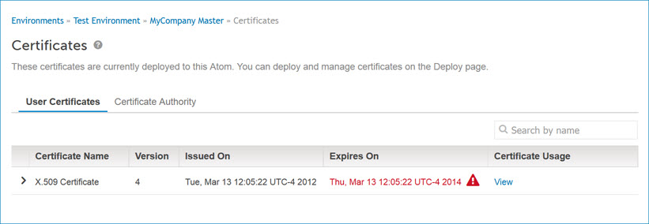
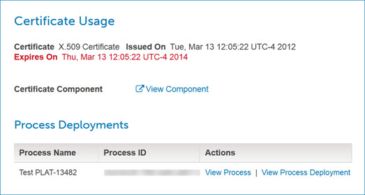

# Certificates panel 

<head>
  <meta name="guidename" content="Integration"/>
  <meta name="context" content="GUID-dd4b2756-2061-46e4-a672-3e9385421e1c"/>
</head>

View the names, locations, expiration dates, and other properties of user and certificate authority \(CA\) certificates.

The **Certificates** panel appears in the Atom Management page \(**Manage** \> **Atom Management**\).

At the top of the Certificates list there is a magnifying glass icon and the words “Search by name.” This indicates that you are seeing the entire list of user or certificate authority \(CA\) certificates. You can search for certificates by typing all or part of a certificate’s name.

## User Certificates Tab 

This tab is used to view information about user certificates that are deployed to the selected Atom, Molecule, or Atom Cloud. For each listed certificate, the following properties are shown:

**Version**  
Multiple versions of the same certificate can be displayed.

**Certificate Usage**  
Clicking **View** displays the Certificate Usage panel with more detailed information, including:

-   a link to view the certificate component
-   a link to view the certificate deployment, if applicable
-   a link to manage the shared web server settings, if applicable
-   a table of process deployments associated with the certificate, if any

     Each row includes:

     -   the process name

     -   the process ID

     -   a link to view the process component

     -   a link to view the process deployment

Clicking **** reveals the following additional certificate properties:

**Owner**  
The following properties of the certificate owner are shown:

-   CN — common name

-   OU — organizational unit

-   O — organization

-   L — locale

-   ST — state

-   C — country

**Issuer**  
The following properties of the certificate issuer are shown:

-   CN — common name

-   OU — organizational unit

-   O — organization

-   L — locale

-   ST — state

-   C — country

**Certificate fingerprint \(MD5\)**  
The MD5 cryptographic hash that is a digest of the entire certificate.

Clicking **** hides these properties.

## Certificate Authority Tab 

This tab is used to view information about certificate authority \(CA\) certificates in the selected Atom, Molecule, or Atom Cloud’s trust store. For each listed certificate, the following properties are shown:

**Owner Common Name**  
The certificate owner’s common name \(CN\), or, if the common name is not specified, all of the specified properties.

Clicking **** reveals the same additional certificate properties as the User Certificates tab.

Clicking **** hides these properties.