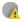

# Cluster Status panel 

<head>
  <meta name="guidename" content="Integration"/>
  <meta name="context" content="GUID-BFE7989E-C6C9-4B9A-B770-46EE834BD039"/>
</head>

The Cluster Status panel appears on the Atom Management page \(**Manage** \> **Atom Management**\) when you click a Molecule or Atom Cloud in the list.

This panel is visible only from the account that owns the Molecule or Atom Cloud. From the Cluster Status panel, you can view the health and status of individual nodes within the cluster, view the head node, and delete nodes from the cluster—ultimately allowing you to scale down your Molecules and Atoms as necessary.

The Cluster Status panel has the following tabs:

**Node Status**  
Lists the nodes in the Molecule or Atom Cloud and displays some basic information about each node. By default, the nodes are sorted by status. You can sort the list by status, node ID, or host name. The columns in the Node Status tab are as follows:

-   The **Status** column displays a list of statuses to indicate the health and state of the node.

    |Icon|Status|Description|
    |:---|:-----|:----------|
    ||Online|This node is online and actively communicating with the platform.|
    ||Starting node|This node is initializing.|
    ||Stopping node|This node is shutting down.|
    ||Restarting node|This node is restarting.|
    ||Node restart timed out|This node attempted a restart, but has not responded in a reasonable time. Check container logs to identify any potential issues.|
    ||Unsuccessful restart|This node attempted a restart, but stopped communicating with the platform. Check your container logs to identify any potential issues.|
    ||Offline|This node shut down successfully and is no longer communicating with the platform.|
    ||Unsuccessful start|This node attempted a start that was unsuccessful and is now offline. Check container logs to identify any potential issues.|
    ||Unsuccessful shut down|This node is offline, but did not shut down gracefully. Check container logs to identify any potential issues.|
    ||Connection error|This node stopped communicating with the platform and may have unexpectedly terminated. Check container logs to identify any potential issues.|
    ||Deleting|This node is waiting for executions to finish before it is deleted and removed from the cluster.|

-   The **Node ID** column displays the unique identifier associated with a particular node in the Molecule or Atom Cloud. A star icon  indicates the cluster's head node.

:::note
     
The node ID does not change while the node is online or when the application restarts on the cluster node. However, actions like stopping and starting your machine could cause the node ID to change. Therefore over time, you may see different IDs for the same node. A Docker node ID is always the node name.

:::

-   The **Host Name** column displays the external host name or IP of the machine where the node currently lives.
-   From the **Actions** column, you can use the **Delete** action to remove a node from the cluster. If the cluster contains only one node, it cannot be deleted.

:::note
    
You must have the Atom Management privilege to remove nodes from the table. If you have the Atom Management Read Access privilege, you can sort the list of nodes and view information about any issues, but you cannot remove a node.

:::

**Cluster Issues**  
Lists any issues reported for nodes in their node.localhostid.dat file \(also known as the “view snapshot” file\). This tab is present only if cluster issues exist.

Clicking an issue’s ** View more** icon reveals details about the issue, including the affected node\(s\). Clicking **** hides the details.

:::note

For nodes that were installed by using Docker, the file name is node.nodeName.dat.

:::
