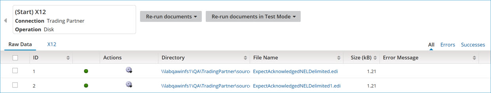
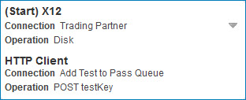

# Connection documents list 

<head>
  <meta name="guidename" content="Integration"/>
  <meta name="context" content="GUID-788cb354-e37f-40e3-af02-b5816db49da1"/>
</head>

The Process execution details’ connection documents list section shows metadata for documents processed through a connection during an execution.

The list also provides a means for viewing the data in the processed documents and rerunning documents.

The section contains the following navigation controls:

** Back to all Connections**  
Navigates back to the summary list of all of the execution’s connections.

** connection menu**  
Selecting a connection in this menu navigates to the documents list for that connection.

  
The top of the section shows the following information about the connector or trading partner step:

**heading** 
-   For a connector step, its type.

-   For a trading partner step, the document standard.

If the step is the Start step, the prefix “\(Start\)” appears here.

**Connection**  
-   For a connector step, the name of the connection component.

-   For a trading partner step, “Trading Partner”.

**Operation**  
  -   For a connector step, the name of the connector operation component.

-   For a trading partner step, the communication method.

## Re-run documents 

Clicking this button initiates a request to rerun the documents whose check boxes are set in the list below. In the confirmation dialog:

-   Clicking **OK** executes the request.

-   Clicking **Cancel** cancels the request.

## Re-run documents in Test Mode

Clicking this button initiates a request to rerun in Test mode the documents whose check boxes are set in the list below. In the confirmation dialog:

-   Clicking **OK** executes the request.

-   Clicking **Cancel** cancels the request.

## All 

Refreshes the list below to include all documents processed through the selected connection. If the list was filtered, clicking **All** discontinues the filtering.

## Errors 

Filters the list below to include only documents with errors processed through the selected connection.

## Successes 

Filters the list below to include only documents successfully processed through the selected connection.

## List 

The document list can be sorted by any of the fields by clicking a column heading. Clicking the column heading again switches between ascending and descending order. By default, documents are sorted in ascending order by their ID.

If this connection is implemented as a trading partner step, the document list is rendered with the following tabs:

**Raw Data tab**  
Raw document files containing EDI data.

**CUSTOM, EDIFACT, HL7, ODETTE, ROSETTANET, TRADACOMS, and X12 tabs**  
Trading partner documents are split out into one tab for each document standard \(Custom, EDIFACT, HL7, ODETTE, RosettaNet, Tradacoms, or X12\).

For inbound EDIFACT, HL7, ODETTE, RosettaNet, or X12 transactions, a second **Acknowledgments** tab lists acknowledgment documents.

For inbound X12 transactions, the **Documents** tab lists only valid documents, and a third **Errors** tab lists invalid documents.

If this is an ordinary connection, the document list is rendered without tabs.

For each document processed through the selected connection, the following properties and actions are shown or available:

**check box**  
If set, a request to rerun the document is initiated when one of the **Re-run** buttons above is clicked.

**ID**  
The unique document ID. This ID is specific to the execution.

**Status**  
-    Success — The document was processed without errors.

-    Error — There was at least one error during processing of the document.

** Actions**  
This menu contains the following selections:

 -   ** View Logs** — Opens the Show Log dialog for viewing events logged during processing of the document.

 -   ** View Document** — Opens the Document Viewer dialog for viewing the data in the document.

 -   ** Re-run Document** — Initiates a request to rerun the document.

 -   ** Run Document in Test Mode** — Initiates a request to rerun the document in Test mode.

 -   ** View Linked Documents** — Opens the View Linked Documents dialog for viewing linked documents processed through previous or subsequent connections.

**additional metadata**  
Additional metadata shown for a document is dependent upon the connection type and whether the document was processed with errors. See the topics about the Document detail view and the Trading Partner results table.

The following controls are used to navigate long document lists:

**First**  
Shows the first documents in the list.

**Previous**  
Shows documents immediately prior to those currently visible in the list.

**Records**  
Indicates the number and relative chronological position of documents currently visible in the list — for example, “Records 51-75 of 2086”.

**Next**  
Shows documents immediately subsequent to those currently visible in the list.

**Last**  
Shows the last documents in the list.