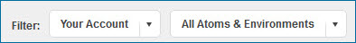
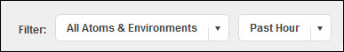
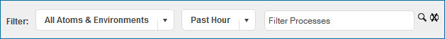

# Dashboard filters 

<head>
  <meta name="guidename" content="Integration"/>
  <meta name="context" content="GUID-0a5a8951-ea81-4315-a861-f1a3f7b0b27e"/>
</head>

All dashboards have filters to set the context for gadgets on the dashboard.

By default, the details of your account are displayed when you click the Dashboard menu and select Account Dashboard. This is the only view for direct customers.

Partners can use the Filter lists to:

-   Display statistics for various accounts or groups that they manage

-   Search for a particular account to which they have access

-   Display statistics for the Atoms and environments that they manage

The HTTP Status Dashboard displays the error message details for your account.

Partners can use the Filter lists to:

-   Select an Atom or environment to see the generated errors

-   Select a time or date range

The Real-time Dashboard is available only if the Services Enablement feature is enabled in your account. When you click the Dashboard menu and select Real-time Dashboard, by default you do not see any low latency processes.

You must use the Filter lists to:

-   Select an Atom or environment to see its low latency processes

-   Search for low latency processes within a specific time and/or date range

-   Select a specific low latency process from the list

Turning on Auto Refresh Table on the HTTP Status Dashboard and Real-time Dashboard updates the dashboard when process results are completed.