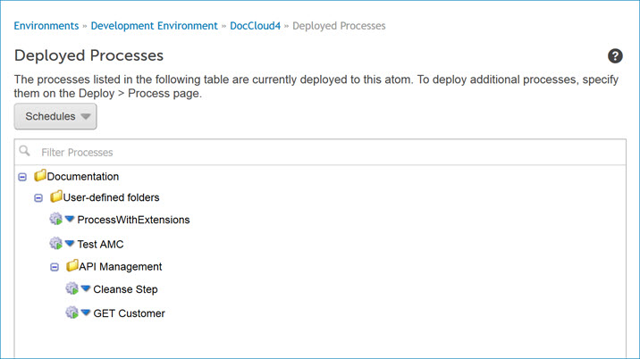

# Deployed Processes panel 

<head>
  <meta name="guidename" content="Integration"/>
  <meta name="context" content="GUID-A22CD8A3-FE07-48C6-88A8-1F3068D4D40E"/>
</head>

The Deployed Processes panel lists all deployed processes, including integration pack processes, for the selected Atom, Molecule, or Atom Cloud.

Access this panel on the Atom Management page \(**Manage** \> **Atom Management**\).

:::note

You must have the Atom Management privilege to modify schedules and properties for deployed processes. If you have the Atom Management Read Access privilege, you can view information about process schedules and properties but you cannot perform any actions.

:::

From within this panel:

**Name**  
**Description**

**Schedules**  
Stops or resumes all of the scheduled processes on the selected Atom, Molecule, or Atom Cloud.

**Filter Processes**  
To search for a deployed process by name, type all or part of its name in the Filter Processes field. Click this  icon to clear the field.

****  
Clicking the blue arrow next to a process displays these menu selections:

-   ** Execute Process** — Executes the selected process. This selection is not available for listener processes.

-   ** Stop Schedules** — Stops the scheduled process. A  red square appears next to the process whose schedule has been stopped. This selection is not available for listener processes.

-   ** Resume Schedules** — Restarts the scheduled process. A  green arrow appears next to the process whose schedule has been started. This selection is not available for listener processes.

-   ** Edit Schedules** — Opens the Scheduling dialog, in which you can add a schedule to a process or edit its schedule. This selection is not available for listener processes.

-   ** Edit Process Properties** — Opens the Edit Process Properties dialog, in which you can edit the process’ properties.

:::note

Integration pack processes are listed on this tab in a separate folder. Within that folder there is a sub-folder for each integration pack to which this Atom, Molecule, or Atom Cloud is attached. Expand a sub-folder to see the list of that integration pack’s component processes.

:::