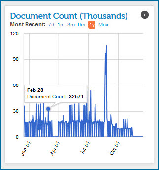

# Document Count gadget 

<head>
  <meta name="guidename" content="Integration"/>
  <meta name="context" content="GUID-d46bd945-89fa-4fda-ab60-da36cad7883d"/>
</head>

The Document Count gadget on the Account Dashboard page shows the total number of documents processed within a particular account or across all accounts in an account group.

The document count is calculated by the total number of inbound documents and the total number of outbound documents. Document Count = \(number of inbound documents + number of outbound documents\).

All graphical data is not real-time data. Instead, the gadget displays a representation of aggregated data referenced in the two to three previous days. These graphs serve as an historical snapshot of the account \(or account group\) data.