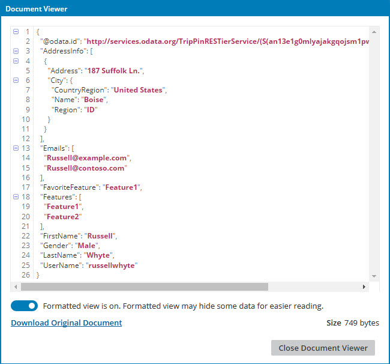

# Document Viewer dialog 

<head>
  <meta name="guidename" content="Integration"/>
  <meta name="context" content="GUID-1608e882-c5c6-4df5-a218-96e17e34e3f4"/>
</head>

When viewing process documents, you can see a sample of the data in the Document Viewer dialog.

The data may be truncated to display the document’s contents as quickly as possible. This allows you to look at the beginning of the document to determine if it looks the way you expect it to. To see the entire document, download it.

The Size field shows the document's size. The following limitations affect what is displayed:

-   If the document contains XML or JSON data, you can view it unformatted by turning off the Formatted view, or formatted by turning on the Formatted view.
-   If the document is 10 kb or less, the entire contents of the document displays but you may need to use the scroll bar to see the end of the document.

-   If the document is larger than 10 kb, only the first 10 kb displays.

-   Documents that are not UTF-8 encoded may not appear correctly.

:::note

You can view document data in the Document Viewer dialog when you are in Test mode.

:::

