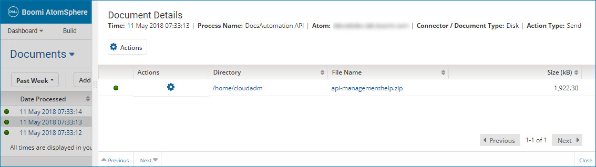

# Document detail view 

<head>
  <meta name="guidename" content="Integration"/>
  <meta name="context" content="GUID-957d11b4-8773-4f50-b4e5-912f14732912"/>
</head>

Clicking a date/time link for a document in the document results table opens the detail view for that document.

Clicking and dragging the  icon in the view border adjusts the width of the view.

The top of the view shows the following information about the document:

**Name**  
**Description**

**Time**  
The date and time at which the document was processed. The date and time are in the format yyyy-MM-dd hh:mm:ss aa, using the time zone in which you are accessing the UI.

**Process Name**  
The name of the process.

**Atom**  
The name of the Atom on which the process executed.

**Connector/Document Type**  
The name of the connector that was used to produce the document — for example, Disk or NetSuite — except in the case of a trading partner document, in which case:

 -   If the document was processed in a trading partner Start step or Trading Partner step configued to receive or send documents for a single document standard, that standard — for example, X12 — is shown.

 -   If the document was processed in a trading partner Start step or Trading Partner step configued to receive or send documents for multiple document standards, edimulti is shown.

**Action Type**  
The type of action that was used by the connector operation to produce the document. For example, Get, Send, Query, Update, No data, etc.

## Actions 

Clicking ** Actions** opens a menu containing the following selection:

**Name**  
**Description**

** Load Execution**  
Finds the execution during which the document was processed.

## Additional metadata 

Additional document metadata is presented in tabular format and is dependent upon the document type.The following metadata and menu are shown or available in the table regardless of document type:

**Status**  
-    Success — The document was processed without errors.
-    Error — There was at least one error in processing the document.

** Actions**  
This menu contains the following selection:

-   ** View Document** — Opens the Document Viewer dialog for viewing the data in the document.

**Size \(kB\)**  
The document file size.

-   For documents retrieved or produced using Disk connector operations, the following additional metadata are shown:

    - **Directory** - The directory, on the system on which the Atom resides, from which or to which the document was read or written.
    - **File Name** - The document filename.

-   For descriptions of trading partner document metadata, see the topic about the Trading Partner results table.

-   For descriptions of metadata for documents retrieved or produced using other types of connectors, see the connector topics.

## Navigation bar

The view contains the following navigation icons:

** Previous**  
Navigates to detail for the previous document in the document results table. Keyboard shortcut: **Up arrow**.

**Next **  
Navigates to detail for the next document in the document results table. Keyboard shortcut: **Down arrow**.

**Close**  
Closes the view, returning focus to the document results table. Keyboard shortcut: **Esc**.

:::note

You can also close the view by clicking in the document results table.

:::
