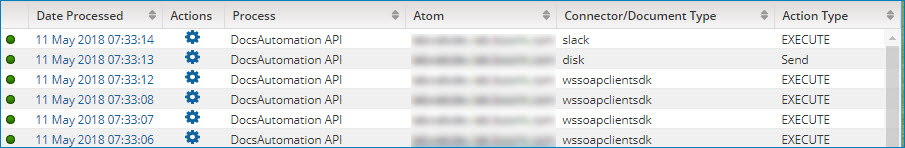

# Document results table 

<head>
  <meta name="guidename" content="Integration"/>
  <meta name="context" content="GUID-b7b823d7-5a19-4943-9571-3845ba128809"/>
</head>

The center of the Process Reporting page contains a table with your search results.

This is what the table looks like when you search for documents.

Each row in the table represents a document and displays the following information:

**Status**  
-    Success — The document was processed without errors.

-    Error — There was at least one error in processing the document.

**Date Processed**  
The date and time at which the document was executed. The date and time are in the format yyyy-MM-dd hh:mm:ss aa, using the time zone in which you are accessing the UI.

Click the link in the Date Processed column to see the Document detail view. For more information, see Viewing Process Execution Documents.

** Actions**  
This menu has the following selection:

-   **Load Execution** — Finds the execution during which the document was processed.

**Process**  
The name of the process.

**Atom**  
The name of the Atom on which the document’s process execution ran. The Atom name is a link to the Atom Information panel in the Atom Management page \(**Manage** \> **Atom Management**\), in which Atom status information is available.

**Connector/Document Type**  
The name of the connector that was used to produce the document, for example, the Disk or NetSuite connector. Or the name of the document type, for example, X12 if it is an X12 EDI document.

**Action Type**  
The type of action that was used by the connector operation to produce the document. For example, Get, Send, Query, Update, No data, etc.