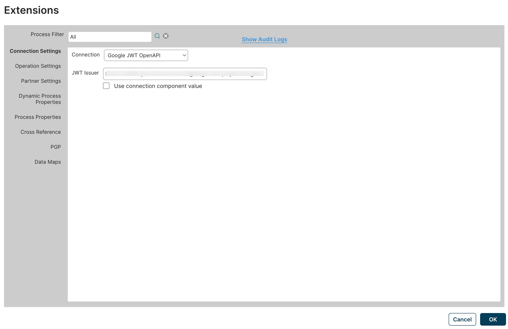

# Environment Extensions dialog 

<head>
  <meta name="guidename" content="Integration"/>
  <meta name="context" content="GUID-3ee06677-2936-432b-9f29-ce4706083fe5"/>
</head>

Set extension values for one or more processes deployed to Atoms attached to the selected environment.

Clicking **Environment Extensions** in the **Environment Properties** tab opens the Extensions dialog.

:::note

You must have the Atom Management privilege \(as well as Environment Management\) to set extensions on the Extensions dialog. If you have the Atom Management Read Access privilege, you can only view existing extensions and open the Audit Logs dialog.

:::

After updating extensions, all listeners restart.

:::info Important

When a process is undeployed and you update or save extensions, those changes related to the undeployed process are lost.

:::