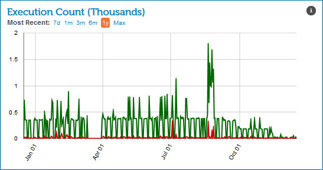

# Execution Count gadget 

<head>
  <meta name="guidename" content="Integration"/>
  <meta name="context" content="GUID-7d62a5bc-ce48-4910-bcb6-9d95e9df4aa9"/>
</head>

The Execution Count gadget on the Account Dashboard page shows the total number of process executions, including subprocesses, for a particular account or across all accounts in an account group.

The green line indicates successful process executions and the red line indicates process executions that resulted in errors.

All graphical data is not real-time data. Instead, the gadget displays a representation of aggregated data referenced in the two to three previous days. These graphs serve as an historical snapshot of the account \(or account group\) data.