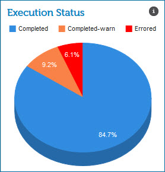

# Execution Status gadget 

<head>
  <meta name="guidename" content="Integration"/>
  <meta name="context" content="GUID-82647705-feb8-4b9d-b3bb-36c8e081476c"/>
</head>

The Execution Status gadget on the Real-time Dashboard page shows low latency process executions by status type that occurred in the time and/or date range that you selected.

The status types are displayed in a pie chart. Pause on a colored area of the pie chart to see the number of executions and the percentage of the total for that status type.

-   Completed — displays in blue

-   Completed with Warning — displays in orange

-   Errored — displays in red

