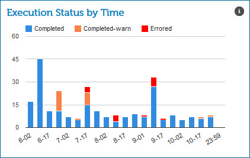

# Execution Status by Time gadget 

<head>
  <meta name="guidename" content="Integration"/>
  <meta name="context" content="GUID-72c5df93-a69e-41a9-b51b-f8cad5580a61"/>
</head>

The Execution Status by Time gadget on the Real-time Dashboard page shows low latency process executions by status type, and time that occurred in the time and/or date range that you selected.

The labels on the X axis vary based on the time and/or date range that you selected. The values on the Y axis vary based on the number of process executions that occurred in the time and/or date range that you selected.

The status types are displayed in a stacked bar chart. Pause on a bar in the bar chart to see the time and/or date and the number of executions for that status in the time group that you selected.

-   Completed — displays in blue

-   Completed with Warning — displays in orange

-   Errored — displays in red

:::note

If the values on the Y axis are very large and the result is very small, you may not see a bar on the chart for the very small result. For example, the largest value is 16,000 and 1 process had an error, then a bar may not appear on the chart.

:::