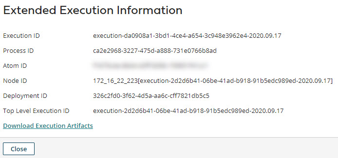

# Extended Execution Information dialog 

<head>
  <meta name="guidename" content="Integration"/>
  <meta name="context" content="GUID-4845051b-504f-44db-b7aa-14ccf66896dc"/>
</head>

The Extended Execution Information dialog provides various IDs.

In the **Manage** menu’s **Process Reporting** page, selecting ** View Extended Information** in either of the following menus opens the Extended Execution Information dialog:

-   ** Actions** menu for a process execution in execution search results

-   ** Actions** menu in an execution detail view

|Name|Description|
|----|-----------|
|**Execution ID**|The ID of the process execution.|
|**Process ID**|The ID of the process.|
|**Atom ID**|The ID of the Atom on which the process ran.|
|**Node ID**|\(Visible only if the process ran on a Molecule or Atom Cloud\) The ID of the node on which the process ran.|
|**Deployment ID**|\(Not visible for test mode executions\) The ID of the deployment.|
|**Top Level Execution ID**|\(Visible only if the process execution that you selected was called by another process. Not visible for test mode executions.\) The ID of the highest level process execution that ultimately caused this process to execute.|
|**Parent Execution ID**|\(Visible only if the process execution that you selected was called by another process. Not visible for test mode executions.\) The ID of the process execution that called this process execution.   If there is only one level of subprocess calls, then the Parent Execution ID and the Top Level Execution ID are the same because they are the same process execution. If there are multiple levels of subprocess calls, then the Parent Execution ID and the Top Level Execution ID are different process executions.|
|**Download Execution Artifacts**|A link to download process execution artifacts, such as process and document logs.  **Note:** In order to view and use this link for downloading execution artifacts, the Cloud owner must first turn on the **Enable Download of Execution Artifacts and Atom Worker Logs** property in the **Manage** \> **Cloud Management** \> **Attachment Quotas** tab.|