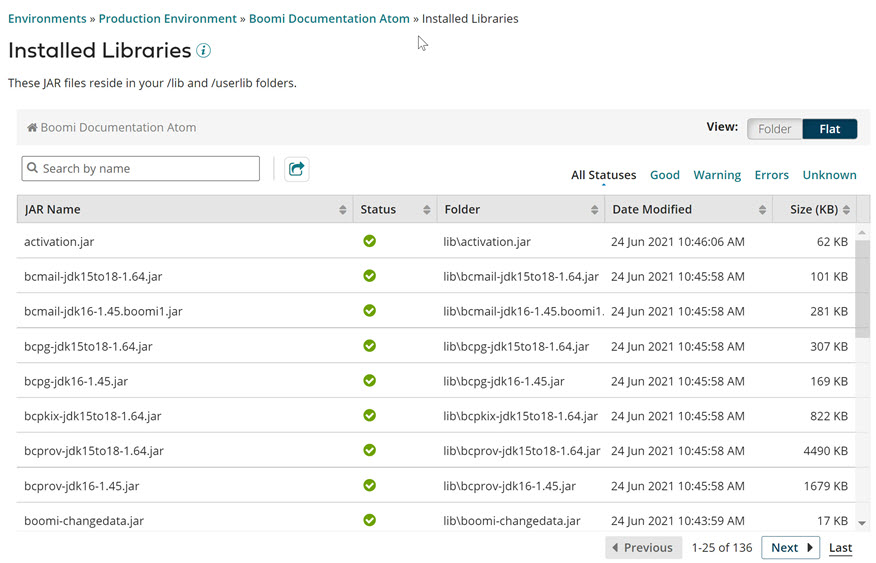

# Installed Libraries panel 

<head>
  <meta name="guidename" content="Integration"/>
  <meta name="context" content="GUID-4b5f6433-487b-4434-b145-b846ef8d0120"/>
</head>

Display the names, locations, size, and status of Java Archive \(JAR\) files that reside in your /lib and /userlib folders.

The **Installed Libraries** panel appears in the Atom Management page \(**Manage** \> **Atom Management**\). If you have JAR files that are specific to a connector or custom scripting, those files appear in the /userlib/\<connType\> or /userlib/script folder.

You can use this panel while troubleshooting issues such as problems with an Atom installation or missing or misplaced custom JAR files.

:::note

For Atom Clouds, this panel consists of two tabs:

-   Account Files — JAR files that reside in your account's /userlib folders.

-   Cloud Files — JAR files that reside in the Cloud's /lib and /userlib folders. Cloud owners see complete information about the files; Cloud tenants do not see the **Status** column.

:::

The list of files in the Installed Libraries panel includes:

-   JAR files

-   custom JAR files that were either

    -   uploaded and deployed as part of a Custom Library component, or
    -   copied into a /userlib folder manually

You can switch between the following views:

-   Flat view, which is the default, shows all JAR files in a single, combined list. The Folder column indicates where each file resides.

-   Folder view groups the files by folder. In this view, the Folder column is not displayed. The JAR Name column can contain either a file name or a folder name.

By default, the files are sorted by name. You can sort the list by any of the available columns.

**Name**  
**Description**

**JAR Name**  
The name of a JAR file or a folder that contains JAR files, such as /lib or /userlib.

**Status**  
The status of the JAR file, which can be:

  
    Good – The file is recognized as either a valid JAR file or a custom JAR file that was uploaded and deployed through the .

 [Warning](../Images/main-ic-exclamation-white-in-yellow-circle-16_97b476a3-c998-4af2-a331-2d3fa76fddc0.jpg)  
    Warning – The file is not recognized as a custom JAR file that was uploaded and deployed through the and it is more than five years old. The file was most likely copied into the /userlib folder manually. You should consider obtaining a newer version of the file.

  
     Errors – The file is recognized as either a JAR file or a custom JAR file that was uploaded and deployed through the . However, the file size or checksum value is not correct. The file might be corrupt.

  
    Unknown – The file is not recognized as a JAR file or any commonly known custom JAR file.

:::note

Cloud tenants do not see the **Status** column on the Cloud Files tab.

:::

**Folder**  
In Flat view, the name of the folder where the JAR file resides.

**Date Modified**  
The date and time at which the JAR file was most recently updated.

**Size**  
The size of the JAR file, in kilobytes.