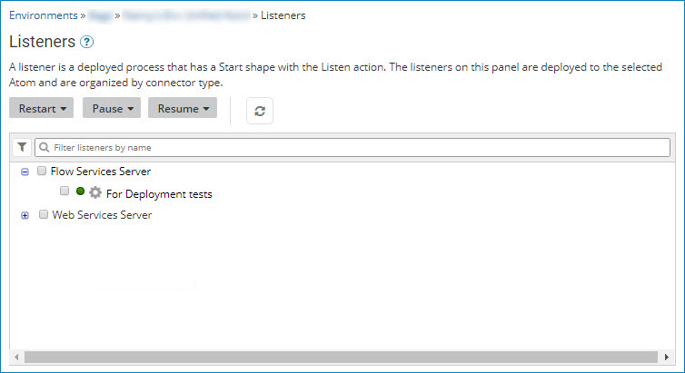

# Listeners panel 

<head>
  <meta name="guidename" content="Integration"/>
  <meta name="context" content="GUID-219C1827-7DCD-44E7-83DD-4662D22EB578"/>
</head>

View and manage listeners, which are deployed processes having a Start step with the Listen action or a Start step with the Trading Partner option.

The **Listeners** panel appears in the Atom Management page \(**Manage** \> **Atom Management**\).

:::note

You must have the Atom Management privilege to manage listeners. If you have the Atom Management Read Access privilege, you can only filter the list of listeners and view information about a listener; you cannot pause, resume, or restart listeners. Additionally, if the selected Atom, Molecule, or Atom Cloud is inactive, its deployed listeners cannot be viewed or managed.

:::

After updating extensions, all listeners restart.

In some situations, a listener's status may inadvertently display the incorrect status. To help when troubleshooting, be aware of the following:

-   A listener's status might appear as Errored, even when it is currently processing messages. This error can happen in a multi-node environment when a listener fails to start on some nodes, but is running on others. In this situation, the listener status appears as Errored, even when it is successfully running on other nodes.
-   A listener's status might appear as Online and listening, even when it is offline and not processing messages. This status can happen if a listener successfully starts, but then loses the connection and goes offline. In this situation, the listener status appears as Online, even when it is Paused or Errored.

## Listener groups \(Connectors and Trading Partners\)

When you select an Atom, Molecule, or Atom Cloud in Atom Management and click **Listeners**, the list of deployed listeners appears.

-   Listeners using connectors are grouped by connector type:

    -   AS2 Shared Server

    -   Atom Queue

    -   Flow Services Server

    -   JMS

    -   MLLP Server

    -   Salesforce Platform Events

    -   SAP

    -   Web Services Server — This grouping includes deployed API Service components. Deployed API Proxy components are not included in this grouping.

-   Listeners using trading partners are grouped by EDI standard:

    -   x12 — Accredited Standards Committee \(ASC\) X12 standard

    -   edifact — UN/EDIFACT \(United Nations/Electronic Data Interchange For Administration, Commerce and Transport\) standard

    -   hl7 — HL7 \(Health Level Seven International\) standard

    -   odette — ODETTE \(Organisation for Data Exchange by Tele Transmission in Europe\) standard

    -   edicustom — User specified standard

    -   rosettanet — ROSETTANET 1.1 and 2.0 standard

    -   tradacoms — The UK-based Tradacoms standard

    -   edimulti — trading partners are configured in the Start step for multiple EDI standards

## Managing listeners

The following properties and tools are available to manage listeners:
   
**Restart \| Pause \| Resume**  
Use these menus to restart, pause, or resume all listeners or selected listeners.

**All Listeners**  
Initiates a request to restart, pause, or resume all listeners with an eligible status.

For example, you can restart all listeners regardless of their status, but only listeners that are currently paused can be resumed.

If you restart a paused listener, the status remains the same after the restart.

**Selected Listeners**  
Initiates a request to restart, pause, or resume each listener whose check box is turned on in the list.

:::note

Toggling the check box for a connector type grouping simultaneously toggles the check boxes for all listeners of that connector type.

:::

****  
Refresh the list of listeners.

A message appears when the receives a restart, pause, or resume request. However, the list of listeners does not refresh automatically. You must manually refresh to view the updated status of listeners.

**Filter listeners**
Use filters and search criteria to find the listeners that you want.

You can filter by a status of **Listening**, **Paused**, or **Errored**. To add a filter, click  and select the filters that you want. If the icon appears decorated , one or more filters are applied. Click the icon to remove or change the filter.

To search, enter all or part of a listener name and click **Enter**. If you applied a filter , a search returns only those items that meet the filter criteria.

****  
Use this menu to perform the following actions for the highlighted listener, depending on its status:

-   **View in Process Reporting** — The Process Reporting page opens a new tab or window with the Executions list filtered by the listener process.

-   **View Deployed Version of Process** — The Build page opens a new tab or window where the deployed version of the listener process appears.

-   **View Error Message** — The Error Message dialog opens, if the listener has an error state. You can view the error message and stack trace.

-   **Pause** — Pauses the listener.

-   **Resume** — Resumes the listener, if it is paused.

-   **Restart** — Restarts the listener.