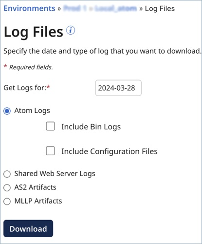

# Log Files panel 

<head>
  <meta name="guidename" content="Integration"/>
  <meta name="context" content="GUID-304FFCC9-F2F2-4AC7-8400-B84DC0E8E71D"/>
</head>

The Log Files panel appears on the Atom Management page \(**Manage** \> **Atom Management**\). The panel is a dialog that is used to download multiple types of logs from an [installation directory](../Atom%2C%20Molecule%2C%20and%20Atom%20Cloud%20setup/r-atm-Installation_directories_fec3863c-e459-439a-91c3-da8bea9b4fb8.md), one type of log per usage. The link that opens the panel is enabled if the current account owns the selected local Atom, Molecule, or Atom Cloud.

- **Get Logs for** - Sets the date for which to download logs. Type a date in the format YYYY-mm-dd, or click in the field to open the calendar and select a date. A valid date is no later than the current date and no earlier than the latest purge date. The dates and times in these log files are based on the JVM’s default time zone.

- **Atom Logs** - Select in order to download log messages related to the general tasks performed by the selected Atom, Molecule, or Atom Cloud.

  - **Include Bin Logs** - (Visible if **Atom Logs** is selected) If selected, the download includes the error.log and restart.log files. These files are useful to have if you are debugging issues related to restarting the selected Atom, Molecule or Cloud. If the bin/views folder exists and contains files, the contents are included in the download.

  - **Include Configuration Files** - (Visible if **Atom Logs** is selected) If selected, the download includes:

    - The contents of the conf/limits directories, if they exist. If you set quotas or limits for individual accounts, then the directories exist.
    - The `bin/*.vmoptions` files.
    - The `bin/*.policy` files.
    - The `bin/procrunner*.<bat \| ps1 \| sh\>` files.
    - The `bin/procbrowser*.<bat \| ps1 \| sh\>` files.
    - The `bin/procworker*.<bat \| ps1 \| sh\>` files.
    - The `bin/restart*.<bat \| ps1 \| sh\>` files.
    - The `conf/container.properties` file.
    - The `install4j/pref_jre.cfg` file.
    - The `libDirListing.csv` file. It contains a list of the following files. For each file, the last modified date, size and MD5 checksum value is provided.
    - Files in the lib and userlib directories, including their subdirectories.
    - For Clouds, the files in the account directory for the account ID of the user requesting the logs.
    - Files in the connectors directory. These files include the connector version in the filename, for example, connector-salesforce-41570-car.zip.
    - Files in the endorsed directory. If you have added [endorsed JAR files](http://docs.oracle.com/javase/7/docs/technotes/guides/standards/) to your Atom, they appear in this directory.

- **Shared Web Server Logs** - Select in order to download the Shared Web Server logs for the selected Atom, Molecule, or Atom Cloud. The logs are specific to the account.

- **AS2 Artifacts** - Select in order to download inbound and outbound AS2 messages, including MDN messages, from the selected Atom, Molecule, or Atom Cloud. Messages are logged from AS2 Shared Server and AS2 Client connectors.

- **MLLP Artifacts** - (Visible if a local Atom or Molecule is selected and HL7 support is enabled in the account) Select in order to download inbound and outbound HL7 messages from the selected single- or multi-tenant runtime. Messages are logged from MLLP Server and MLLP Client connectors.

- **Download** - Submits the download request.
