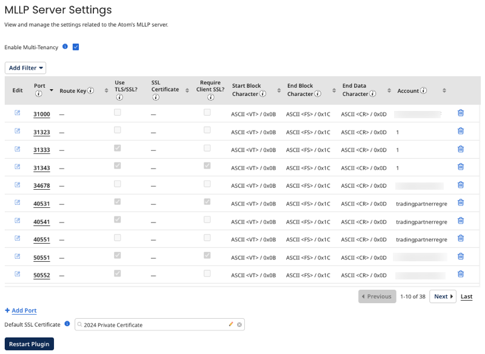

# MLLP Server Settings panel

<head>
  <meta name="guidename" content="Integration"/>
  <meta name="context" content="GUID-e60ac7aa-e6ce-45e9-9b5f-7701bb443cc8"/>
</head>

You can use the MLLP Server Settings panel in Atom Management to specify the port on which the MLLP (Minimal Lower Layer Protocol) server listens for inbound HL7 message transmissions. Configure your firewall to allow MLLP traffic on the specified port. You can also use the JMX client with the MLLP Server to list certificates in the trust store and export the trust store to a file on disk.

:::note

You must have HL7 support enabled in your account to configure MLLP Server Settings.

:::

The MLLP Server Settings panel displays ten configured ports at a time. Use the **First**, **Previous**, **Next**, and **Last** buttons to browse through pages to view additional ports. You can also click any column to sort the listed ports by that column.

:::info Important

You must restart the MLLP plugin before new port configurations take effect.

:::

- **Enable Multi-Tenancy** - If selected, you can assign MLLP Server ports to specific accounts.

- **Port** - Sets the port on which the Atom's MLLP server listens for inbound message transmissions.

- **Route Key** - Manages direct routing from one or more received ports to a listen process. You can use any string to represent the routing path.

- **Use TLS/SSL?** - When checked, the server establishes a secure communication channel with the client. If enabled, the client connection must provide a certificate to authenticate to the server.

- **SSL Certificate** - (Available if TLS/SSL is enabled.) The SSL certificate for this port. If not specified, the port uses the server's default SSL certificate.

- **Require Client SSL?** - (Available if TLS/SSL is enabled.) When checked, the server performs client authorization.

- **Start Block Character** - The start block character configured for the MLLP data frame. You can select *other character* or *byte character* and enter a custom value by editing an existing port or adding a new one.

- **End Block Character** - The end block character configured for the MLLP data frame. You can select *other character* or *byte character* and enter a custom value by editing an existing port or adding a new one.

- **End Data Character** - The end data character configured for the MLLP data frame. You can select *other character* or *byte character* and enter a custom value by editing an existing port or adding a new one.

- **Account** - (Available if multi-tenancy is enabled.) The account to which you want to assign the MLLP Server port.

- **Default SSL Certificate** - The default SSL certificate used for all ports where a port-specific SSL certificate is not configured.

## Multi-tenancy

You can add multiple listening ports to use multiple protocol listeners concurrently. Each port can have its own TLS/SSL configuration, but all ports share the same server SSL certificate unless there is a port-specific SSL certificate assigned. You can also enable multi-tenancy to assign ports to specific accounts you own or manage. If you turn off multi-tenancy after assigning ports to accounts, the accounts are cleared from the ports.

:::note

You must have the Atom Management privilege to configure ports. If you have the Atom Management Read Access privilege, you can view but not change information.

:::

## Framing characters

MLLP data frames consist of a start block character, data bytes, an end block character, and an end data character. The system defaults to the values outlined in the MLLP specification, but you can enter custom values as needed. Other characters are standard ASCII printable characters. Byte characters are numeric or hexadecimal expressions representing non-printable or special characters you might want to use.

:::note

Configuring framing characters in the MLLP Server Settings panel applies the settings to all documents the server receives for each port.

:::

## Filtering ports

You can filter your ports by the following configuration settings:

- Port
- Route Key
- Use TLS/SSL?
- Require Client SSL?

After selecting the criteria by which you want to filter, enter a value. For example, if you want to filter by whether a port requires client SSL, select **Require Client SSL?** from the filter list and then **True**. Click **Apply** to apply the filter to the ports.

Each filter is an exact match, except for **Route Key**, which returns partial matches and ignores case.

You can remove the filter by clicking the **Clear** icon.
