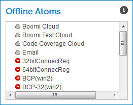

# Offline Atoms gadget 

<head>
  <meta name="guidename" content="Integration"/>
  <meta name="context" content="GUID-027905ab-7727-462b-a46b-21246888bc6e"/>
</head>

The Offline Atoms gadget on the Account Dashboard page shows a real-time running total of the offline Atoms for the account\(s\) that you are currently viewing.

This list is affected only by the account filter that you selected. If you also filtered by Atom or environment, that filter is ignored. Offline Atoms and Molecules have a red icon next to it.

:::note

You can set up a subscription to receive email alerts about Atom status.

:::