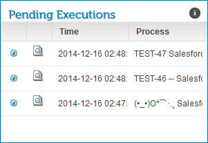
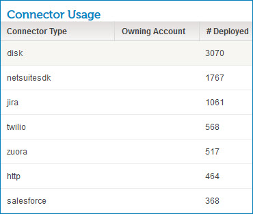

# Pending Executions gadget and Connector Usage gadget 

<head>
  <meta name="guidename" content="Integration"/>
  <meta name="context" content="GUID-63f12904-16c9-4caa-9c93-6207c0c7b201"/>
</head>

Pending Executions displays currently executed processes. Connector Usage shows real-time, deployed connections across all accounts in a particular account group.

If you are viewing individual accounts, you see the Pending Executions gadget on the Account Dashboard page.

If you are viewing all accounts, you see the Connector Usage gadget on the Account Dashboard page. It is visible only to partners who manage multiple accounts or account groups.

The Connector Usage gadget displays the following details.

**Connector Type**  
The type of connector. If the connector is privately owned, the state of the connector, such as "development" or "production," appears in parenthesis after the type.

If you click a connector type in this column, you can see the account name and account ID.

**Owning Account**  
Indicates who owns the account. If the connector is owned by , nothing appears in this column. If the connector is privately owned, the owner's account name appears.

**Number of Connections**  
The current number of connections.