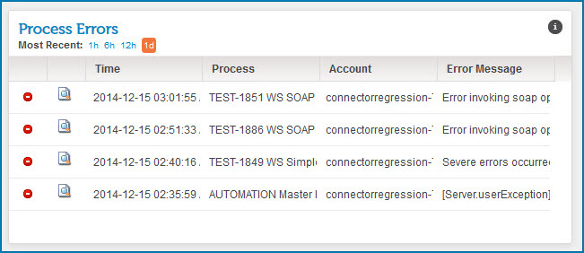
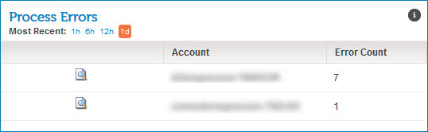

# Process Errors gadget 

<head>
  <meta name="guidename" content="Integration"/>
  <meta name="context" content="GUID-f9de04f4-59ec-4a2c-8667-cf64faace7d2"/>
</head>

The Process Errors gadget on the Account Dashboard page shows all processes with errors for a single account.

For grouped accounts, the Process Errors gadget shows all accounts for the given account group with errors.

