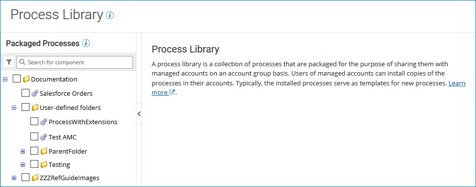
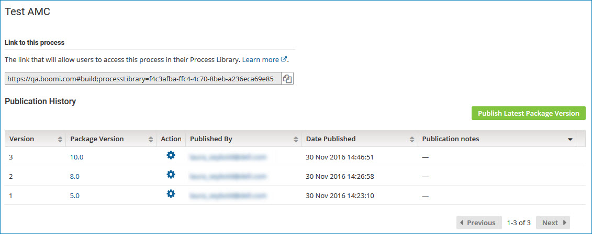
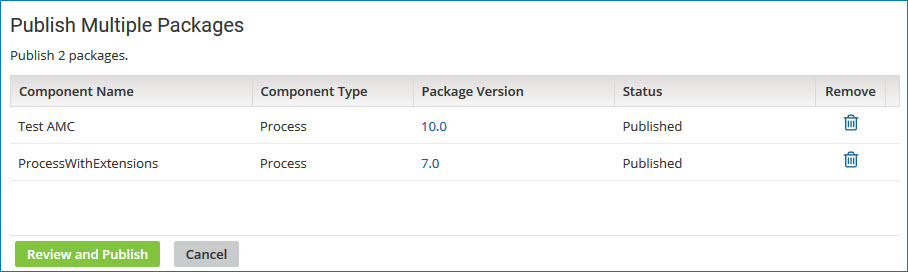

# Process Library page 

<head>
  <meta name="guidename" content="Integration"/>
  <meta name="context" content="GUID-1fe3f73c-a4a0-4ec2-a750-0485dfb5a181"/>
</head>

The **Process Library** page \(**Manage** \> **Process Library**\) lets you manage the Process Libraryand publish processes that have been packaged and marked as shareable.

:::info Important

Before you can publish processes, you must update the **Publisher** tab \(**Settings** \> **Account Information and Setup** \> **Publisher**\) with a publisher name and, optionally, other publisher information. You must also package the process from the **Packaged Components** page \(**Deploy** \> **Packaged Components**\) before you can publish to the Process Library.

:::

The **Process Library** page lists the processes that have been packaged and marked as shareable.

When you select a single packaged process from the list \(the process is highlighted\), the Publication History table for that process is displayed.

By default, the table displays, in descending order, the last 10 published versions of the process that is highlighted in the Packaged Processes list. You can also sort the list by:

-   Package version: identifies the version of the packaged component. The package version was specified by the user who initially created the packaged component

-   User who published the packaged component: the email address of the user.

-   When the packaged component was published: the date and time at which the packaged component was published.

-   Notes, if any that describe the publication.

You can use the **Action** column to view the publication details, compare the published version with another version, and republish a previous version.

If you selected multiple processes in the Packaged Processes list, the **Publish Multiple Packages** page is displayed.

