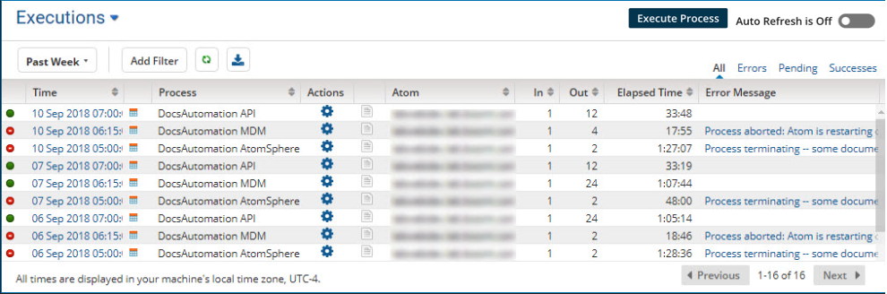
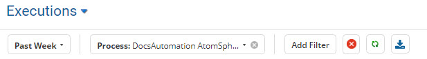
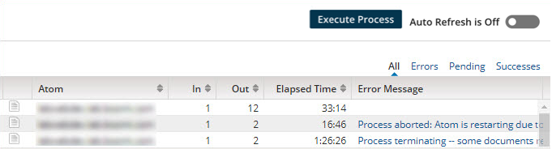
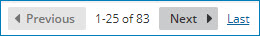
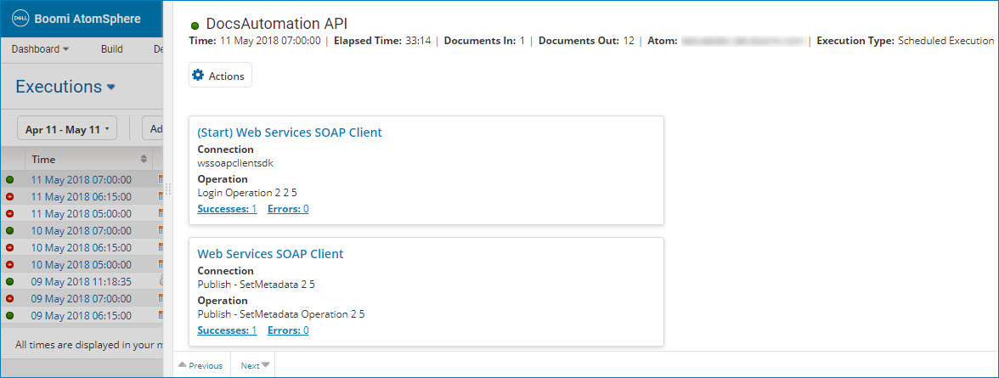

# Process Reporting page 

<head>
  <meta name="guidename" content="Integration"/>
  <meta name="context" content="GUID-77bf7bfe-22a1-4085-b151-0c7ab829207f"/>
</head>

The Process Reporting page displays information about process executions and their related documents and logs.

Accessed through **Manage** \> **Process Reporting**, you can search by process execution, document, or trading partner document.

:::note

You can display test mode executions on the Process Reporting page, but no documents or logs are available for those executions.

:::

You also can specify a date and time range. Some filters vary based on whether you are searching by process execution, document, or trading partner document. As you select filters, they appear in a row above the search results table. You can clear individual search filters or all filters. There is also a button for refreshing the table results manually, and one for exporting the results to a CSV file.

On the top right side of the Process Reporting page there are controls for:

-   Selecting and executing a process manually.

-   Turning **Auto Refresh Table** on or off. When **Auto Refresh Table** is on, the search results table is updated every minute. If you start to page through the list of results, **Auto Refresh Table** is turned off automatically.

-   Filtering the search results table by all process executions or documents, executions or documents with errors, pending executions, or successful executions or documents.

The center of the Process Reporting page contains a table with your search results. The columns in the table vary, based on whether you are searching by process execution, document, or trading partner document. Each row represents a process execution or document. Process executions and documents have a green or red icon indicating success or failure. Process executions can have a blue icon indicating that it is pending. Each row in the table contains links and/or icons that you can click to see documents, logs, data, etc. related to the process execution or document. Use the logs to troubleshoot errors and to determine why a document failed.

:::note

It may take the Process Reporting screen up to 10 seconds to show a true status after the execution completes. Therefore, we recommend waiting 10 seconds to refresh the screen after the execution completes—otherwise you may notice inconsistent results.

:::

The Atom column appears in the process execution, document, and trading partner document results tables. In this column, the Atom name links to the Atom Information panel in the Atom Management page \(**Manage** \> **Atom Management**\), in which Atom status information is available.

Search results are displayed after the platform receives them from the Atom. Depending on the complexity of the process, the volume of data, and varying Internet connection speeds \(if the Atom is running in your local network\), it may take up to several minutes for results to be posted. Click the **Refresh** button or turn on the **Auto-Refresh Table** in the top-right corner of the page to see updated results each minute.

**Note:** If you open the process execution or Document detail view, or if you click the First, Previous, Next or Last navigation buttons, **Auto Refresh Table** is turned off automatically.

The search results table can be sorted by any of the fields by clicking a column header. Click the column header again to switch between ascending and descending order. By default, results are displayed by date and time in descending order.

The bottom of the Process Reporting page contains controls for navigating to the first, previous, next or last page of search results. You can also see how many records were returned in the search results and the record numbers on the current page. You may need to use the scroll bar on the right to see all of the records on the current page.

Clicking the date and time link in a row displays more detailed information about the process execution or document. The detail view slides over from the right side and partially overlaps the search results table. From the process execution detail view you can see the corresponding outbound and inbound documents, see the actual data contents, and rerun a document.

:::note

The process execution detail view is not available for test mode executions.

:::

