# Process Reporting search options and filters 

<head>
  <meta name="guidename" content="Integration"/>
  <meta name="context" content="GUID-fdf2fa4d-d62c-4cae-99be-603f5f185a40"/>
</head>

On the Process Reporting page, you can change the search criteria and time frame and use filters to find data.

When you open the Process Reporting page \(**Manage** \> **Process Reporting**\), by default the displays the deployed process executions that occurred in the account within the past hour.

Process Reporting filters maintain a list of all versions of processes that have been deployed and executed, renamed, deleted, or otherwise. You can search for process executions even if the component itself has since been deleted or renamed. You cannot remove old names from returned search results.

First you must decide what you want to search for:

-   Process executions

-   Documents

-   Trading Partner documents

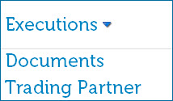

Next you can select a date and time range. You can search by:

-   Past Hour

-   Past 24 Hours

-   Past Week

-   Date Range — You must specify dates and can specify times. By default the date range is set to the past month.

:::note

The Process Reporting page displays execution times in the time zone of the machine from which you are accessing the UI. The Atom, Molecule, or Atom Cloud where the process ran might reside in a different time zone.

:::

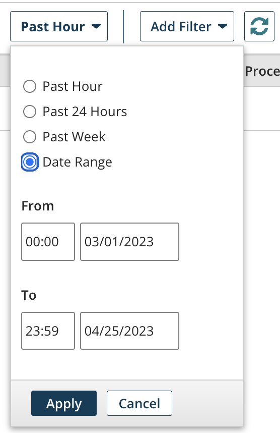

Next you can add one or more filters.

-   To add filters, click Add Filter.

-   To clear the selected filter, click a  gray Clear icon or click the  Clear All Filters icon.

-   To update the list with the current filters, click the  Refresh icon. New data may meet the filter criteria.

-   Some filters vary based on whether you are searching by process execution, document, or trading partner document.

-   When searching for process executions, documents, or trading partner documents, you can filter by Atom\(s\). The Atoms list displays all Atoms in the account. You can search for process executions, documents, or trading partner documents that were executed on a particular Atom. You can select one to 10 Atoms. If you do not set this search parameter, then executions or documents that ran on any Atom in the account are displayed.

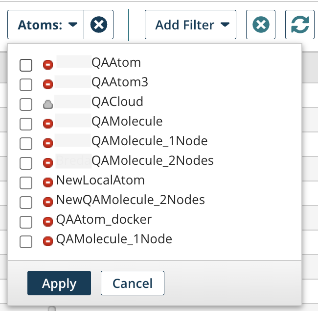

Finally, you can filter the results in the table by:

-   All — All process executions or documents

-   Errors — Process executions or documents with errors

-   Pending — Process executions that have not yet completed

-   Successes — Successful process executions or documents

## Process execution searching 

When you search for process executions, you can set one or more of the following filters:

**Date and time range**  
Described above.

**Atoms**  
Described above.

**Process**  
Opens the dialog used to search for executions of one or more processes that have ever been deployed. If your account has access to integration packs, the list includes processes that have been released as part of those integration packs.

You can search for process executions that have been deployed by typing part or all of a process name, or the entire process ID in the Filter Processes field. If you do not set this search parameter, then the executions or documents for any process in the account are displayed.

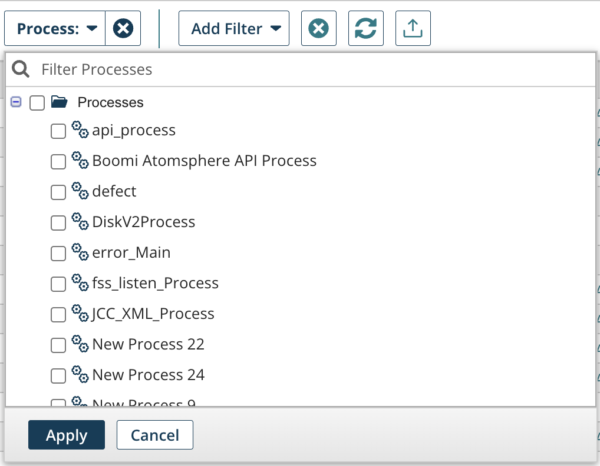

:::note

Processes that have been run in test mode but never deployed are not included in the list.

:::

**Execution ID**  
Opens the dialog used to search for a specific process execution by execution ID. This is commonly used for administrative review. Because this filter allows you to search for a unique process execution, it works differently from other filters:

-   If the Execution ID filter is selected first \(after the date and time range filter\), you cannot add more filters to your search criteria.

-   If another filter is selected first \(after the date and time range filter\), you cannot add the Execution ID filter to your search criteria.

-   If you select a date and time range and then add the Execution ID filter, your date and time range filter is removed. If you remove the Execution ID filter, the date and time range filter becomes available again.

-   After the Execution ID filter is applied, the results are set to All. The resulting Execution is also displayed on the Errors, Pending or Successes results page, as appropriate for the execution.

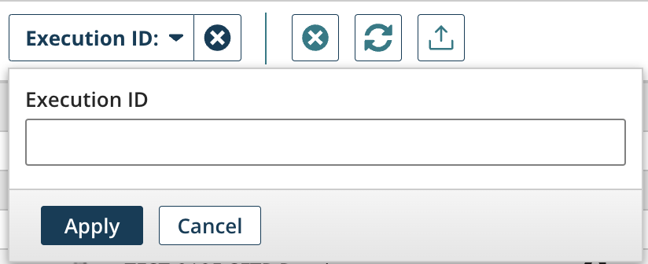

**Hide Successes with 0 Inbound Docs**  
Used to search for executions with one or more inbound documents. If this filter is on, it also returns processes with errors, even if they do not have any inbound documents.

**Execution Modes**  
Opens the dialog used to search for executions by the execution type: Listener, Manual, Manual Retry, Scheduled, Scheduled Retry, Sub Process, or Test Mode.

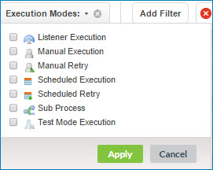

## Document searching

When you search for documents, you can set one or more of the following filters.

**Date and time range**  
Described above.

**Atoms**  
Described above.

**Connector Type**  
Opens the dialog used to search for documents for a specific connector type. You can select one connector from the list. If you do not set this search parameter, the filter closes.

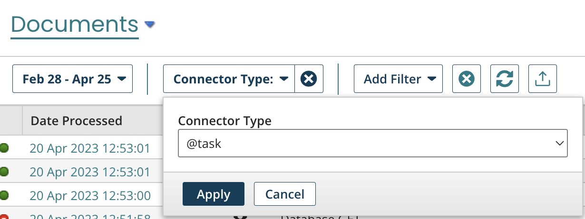

**Tracked Fields**  
Opens the dialog used to search for a value in the user-defined tracked fields, connector attributes, and document standard attributes.

**Search for**  
Sets the value for which to search.

**In**  
Selects user-defined tracked fields, connector attributes, and document standard attributes. Turn on one to 10 check boxes.

-   User-defined fields — List of the tracked fields from the Setup page's Document Tracking tab. Refer to the Document Tracking topic to learn how to expose tracked fields in your connector operations for searching.

-   Connector attributes — List of core connector properties that are captured per document.

-   Document standard attributes — List of standard X12, HL7, EDIFACT, and ODETTE EDI properties captured for EDI processing.

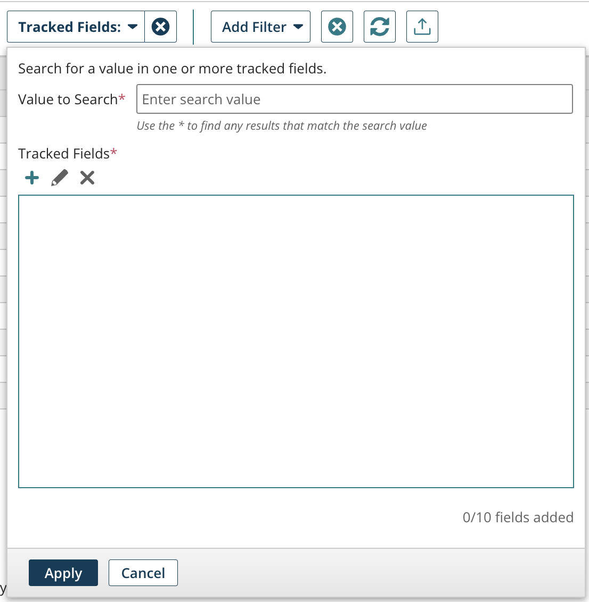

**Execution ID**  
Opens the dialog used to search for a specific document by execution ID. This filter is commonly used for administrative review. The filter works in combination with other document filters.

## Trading Partner document searching

:::note

The Trading Partner step, EDI, and B2B solutions are in their own Integration edition. To enable these capabilities in your account, contact your Boomi account representative.

:::

When you search for trading partner documents, you can set one or more of the following filters.

Filtering by document standard is always applied.

**Time and/or date range**  
Described above.

**Atoms**  
Described above.

**Tracked Fields**  
Described in the Searching by Documents section.

**From Trading Partner**  
Opens the dialog used to select a Trading Partner component for inbound documents.

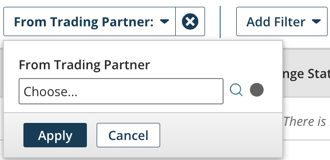

**To Trading Partner**  
Opens the dialog used to select a Trading Partner component for outbound documents.

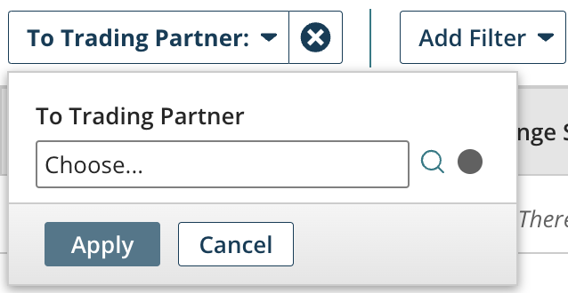

**\(standard\) Document Standard**  
Opens the dialog used to search for trading partner documents that use the selected document standard.

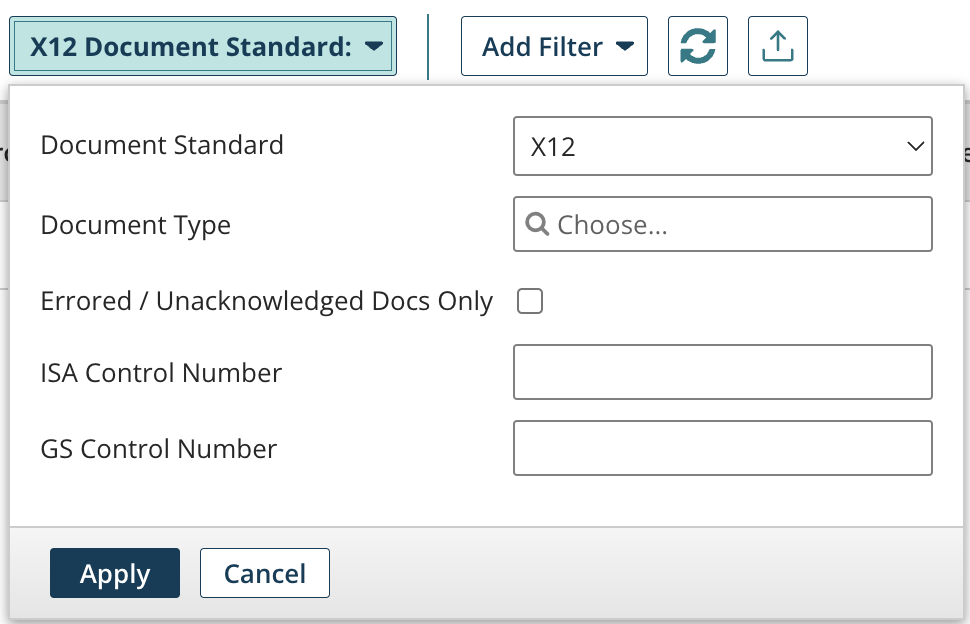

**Document Standard**  
Selects the document standard — X12, EDIFACT, HL7, CUSTOM, ROSETTANET, TRADACOMS, or ODETTE. X12 is the default.

**Document Type**  
Used to search for trading partner documents with a specific transaction set ID, related to the selected **Document Standard**.  

**Errored / Unacknowledged Docs Only**  
If selected, returns trading partner documents that were not acknowledged or that failed.

**ISA Control Number**  
\(X12 **Document Standard** only\) Used to search for documents with a specific ISA control number.

**GS Control Number**  
\(X12 **Document Standard** only\) Used to search for documents with a specific GS control number.

**Interchange Control Reference Number**  
\(EDIFACT **Document Standard** only\) Used to search for documents with a specific Interchange Control Reference Number.

**Sender ID** 
\(ROSETTANET **Document Standard** only\) Used to search for documents with a specific sender ID.

**Receiver ID**  
\(ROSETTANET **Document Standard** only\) Used to search for documents with a specific receiver ID.

**PIP Code**  
\(ROSETTANET **Document Standard** only\) Used to search for documents with a specific Partner Interface Process \(PIP\) code.

**In Response to Instance Identifier**  
\(ROSETTANET **Document Standard** only\) Used to search for response documents for which the request has a specific Action Instance Identifier.

**Transaction Instance Identifier**  
\(ROSETTANET **Document Standard** only\) Used to search for documents with a specific Transaction instance identifier.