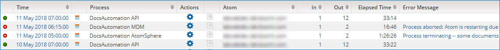

# Process execution results table 

<head>
  <meta name="guidename" content="Integration"/>
  <meta name="context" content="GUID-d31a4174-8f19-444b-9fcc-0bd1e4abfc32"/>
</head>

The center of the Process Reporting page contains a table with your search results.

This is what the table looks like when you search for process executions.

Each row in the table represents a process execution and displays the following information.

**Status**  
-  The process has started. You might see one of the following tooltips:

  - Starting - The process is starting. Processes start so quickly that it is unlikely that you will see this tooltip.
  - Enqueued - If the number of simultaneous process executions per node exceeds the limit, the process is in the queue. This tooltip applies only to non-low latency process executions. You can cancel a queued process execution.
  - Pending — The process is pending completion. You can cancel a pending process execution.

-  The process and all documents were processed without errors.

-  There was at least one wrning in processing one or more documents. This status applies to low latency processes.

-  There was at least one error in processing one or more documents, the process was aborted, or the process was discarded.

**Time**  
The date and time at which the process began to execute. The date and time are in the format yyyy-MM-dd hh:mm:ss aa, using the time zone in which you are accessing the UI.

Click the link in this column to see a process execution’s documents.

:::note

No documents are available for test mode executions.

:::

**Execution Type**  
Indicates how the execution was triggered:

**Process**  
The name of the process.

**Actions**  
-    Actions — Click the icon to see the available actions: View Process, View Deployment Components, View Process State, View Extended Information, or Terminate Process Execution.

-    View Process Logs — Click to view the process-level log information. If a process does not execute, because it was discarded or because the user tried to execute it when it was already running, a log is not created. If that is the case, this icon is not available.

:::note

For test mode executions, the available actions are: View Process, Terminate Process Execution, and a limited version of View Extended Information. Process logs are not available for test mode executions.

:::

**Atom**  
The name of the Atom on which the process ran. The Atom name is a link to the Atom Information panel in the Atom Management page \(**Manage** \> **Atom Management**\), in which Atom status information is available.

**In**  
The number of documents read into the process. A single document can represent a batch containing many individual records.

**Out**  
The number of documents sent out of the process. This number represents an aggregate of all the documents sent by a Send connector. If a single document is sent to multiple outbound connectors, it is counted for each. Splitting and combining documents within the process has a direct affect on this value.

**Elapsed Time**  
The total duration \(in seconds\) of the process execution.

**Error Message**  
If there is a process-level error, it appears here. If the error message is too long for the column, you can double-click the message to open it in a dialog or open the process execution detail view to see it in its entirety.