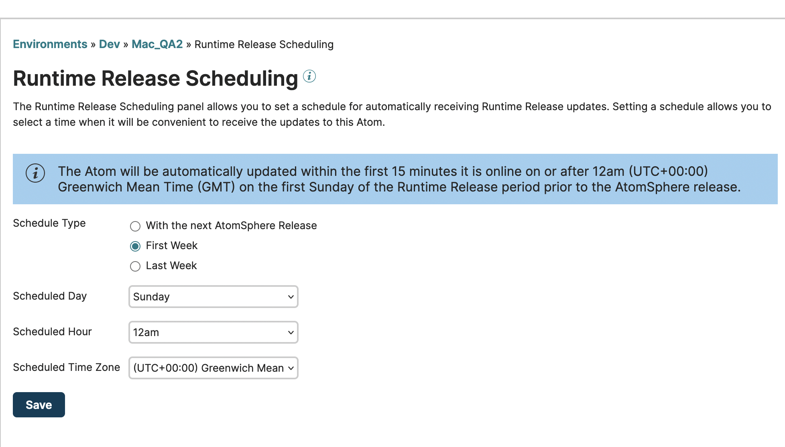

# Runtime Release Scheduling panel 

<head>
  <meta name="guidename" content="Integration"/>
  <meta name="context" content="GUID-60CC6FED-965D-46A2-A6C8-88141B965C16"/>
</head>

If your account owns an Atom, Molecule, or Atom Cloud, you can set a schedule to receive updates automatically.

The Runtime Release Scheduling panel appears on the Atom Management page \(**Manage** \> **Atom Management**\). By setting a schedule you can select a convenient time for an Atom, Molecule, or Atom Cloud to receive the Runtime Release updates.

:::note

If your account does not own the selected Atom, Molecule, or Atom Cloud, or if the chosen Atom is attached to an Atom Cloud, the Runtime Release Scheduling panel does not appear.

:::

Updates are available with the Runtime Release, which is the release containing runtime features, enhancements, and fixes, that occurs two weeks immediately preceding a Platform release. As the owner of an Atom, Molecule, or Atom Cloud, you can select the week, day, hour, and time zone in which you want the updates to be applied. If you do not set a schedule, the Atom, Molecule, or Atom Cloud is updated automatically on the release date. You can change the Runtime Release schedule for an Atom, Molecule, or Atom Cloud at any time. For more detailed information, see the topic [Runtime and Platform Release](/docs/Atomsphere/Platform/atm-Runtime_and_Atomsphere_releases_8aa6b48e-b0b6-4382-8ffa-a7cf23f0314f.md).

:::info

You must have the Atom Management privilege to schedule Runtime Release updates. If you have the Atom Management Read Access privilege, you can view but not change the schedule.

:::

**Schedule Type**  
The type of Runtime Release schedule that you want to implement:

- **With the release** - The Atom is not automatically updated with the Runtime Release. The updates occur with the next release.

- **First Week** - The Atom is automatically updated the first time it is online on or after *12am \(UTC+00:00\) Greenwich Mean Time \(GMT\)* on the first *day* of the Runtime Release.

  The first week of the Runtime Release begins on the day that updates are made available \(typically, the Saturday that comes 14 days before the Platform release\).

- **Last Week** - The Atom is automatically updated the first time it is online on or after *12am \(UTC+00:00\) Greenwich Mean Time \(GMT\)* on the last *Sunday* of the Runtime Release.

  The last week of Runtime Release begins seven days before the Platform release.

  :::note

  The exact day on which Runtime Release begins can vary from release to release. Upcoming Runtime Release dates are listed on the [Notifications page](https://stats.boomi.com/notifications/).

  :::

**Scheduled Day**  
The day on which Runtime Release updates should be applied.

**Scheduled Hour**  
The time at which Runtime Release updates should be applied.

**Scheduled Time Zone**  
The time zone in which Runtime Release updates should be applied.