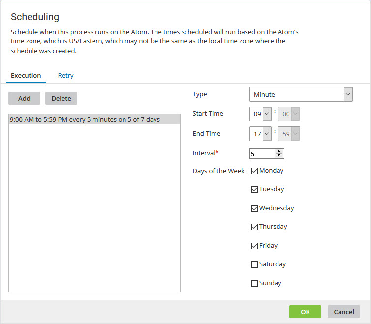
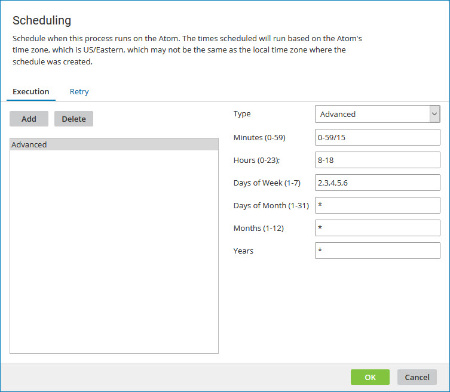
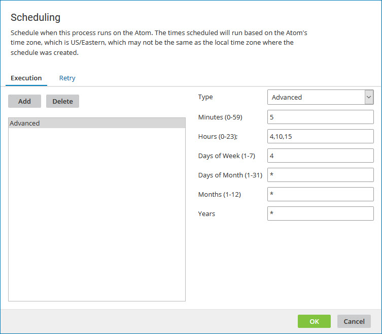

# Scheduling dialog 

<head>
  <meta name="guidename" content="Integration"/>
  <meta name="context" content="GUID-babff655-b7a2-4037-a457-03be29540f09"/>
</head>

Schedule when a process runs by designating the time, days, and interval at which it runs.

:::note

The local system time zone of the Atom, Molecule, or Atom Cloud where the process runs determines when the schedule is executed. That time zone is shown in the descriptive text near the top of the Scheduling dialog. The schedule executes according to the system time *of the machine on which the Atom, Molecule, or Atom Cloud is installed*, not of the machine from which you set the schedule. If the Atom, Molecule, or Atom Cloud is installed in one time zone and the machine from which you set schedules is in a different one, you need to be aware of that difference in time zones.

:::

If the **Default Time Zone for Account Schedules** advanced property is set for an account on a private Atom Cloud, the property overrides the time zones of process schedules across the account, so that all process schedules abide by the time zone set in the property. All public Atom Clouds and Test Atom Clouds are configured to use the Etc/UTC time zone, except where noted in the Related reference for Hostnames and IP addresses for the Atom Clouds and Hub Clouds.

The smallest interval between automated executions for any process schedule is one minute.

A process configured with the following schedule runs every 5 minutes between 9:00 A.M. and 5:59 P.M. on Monday through Friday.

If you set the Type to "Day", specify an interval and select one or more days of the week, the process runs on every "interval" day that falls on a selected day of the week.

## Advanced schedules 

You can use advanced \(cron\) syntax to set your schedule to run periodically at certain times or dates. Access Advanced mode by selecting it from the Type drop-down list.

Placing an asterisk \[\*\] in a field indicates that the schedule should run every minute, hour, day of the week, day of the month, month or year. Hyphens \[-\] are used to specify ranges of values, and commas \[,\] are used as delimiters between values and ranges. The time specification of a range, whether it be years, months, days of the month or week, hours or minutes, can optionally be followed by a slash \[/\] and an interval of that unit of time. For example:

In the Minutes field, a value 0-59/15, specifies 0, 15, 30 and 45 minutes after the hour. In the Days of Month field, a value of 3-30/3 specifies every third day beginning with the third day of the month.

- **Type** - Advanced

- **Minutes \(0-59\)** - 0 is the first minute of the hour — for example, 1:00 A.M.

  59 is the last minute of the hour — for example, 1:59 A.M.

- **Hours \(0-23\)** - A 24-hour clock is used.

  0 is 12:00 A.M. or midnight and 12 is 12:00 P.M. or noon.

- **Days of Week \(1-7\)** - 1 is Sunday and 7 is Saturday.

- **Days of Month \(1-30 or 31\)** - 1 is the first day of the month and 30 or 31 respectively is the last day of the month.

- **Months \(1-12\)** - 1 is January and 12 is December. In most cases this is set to an asterisk \[\*\].

- **Years** - Standard year format. In most cases this is set to an asterisk \[\*\].

A process configured with the following schedule runs every 15 minutes between 8 A.M. and 6 P.M. on Monday through Friday on all days of the month that match the days of the week specified.

A process configured with the following schedule runs at the following times each Wednesday:

- 4:05 A.M.

- 10:05 A.M.

- 3:05 P.M.

:::note

Currently, Boomi doesn't support configuring a biweekly (every two weeks) schedule through the Scheduling dialog. You can use a persisted process property to cause a process to run at a specified interval. For more details, refer to the Community article [How to set up a biweekly schedule in Boomi](https://community.boomi.com/s/article/How-to-set-up-a-biweekly-schedule-in-Boomi).

:::
